<p align="center"></p>

# ATS Filter Simulator

[](https://github.com/shreyosecret/ATSResumeFilter/actions/workflows/tests.yml)

A Python simulator that parses resumes the way a simple applicant tracking system does, screens them with knockout rules, ranks them against a job posting with three scoring methods, and runs controlled experiments to measure which resume choices actually change the outcome.

This is **a simulator modeled on documented ATS behavior**, not a reproduction of any vendor's system. Workday, Greenhouse, Lever and iCIMS are proprietary, and nothing here says how any of them scores a real person.

## The app

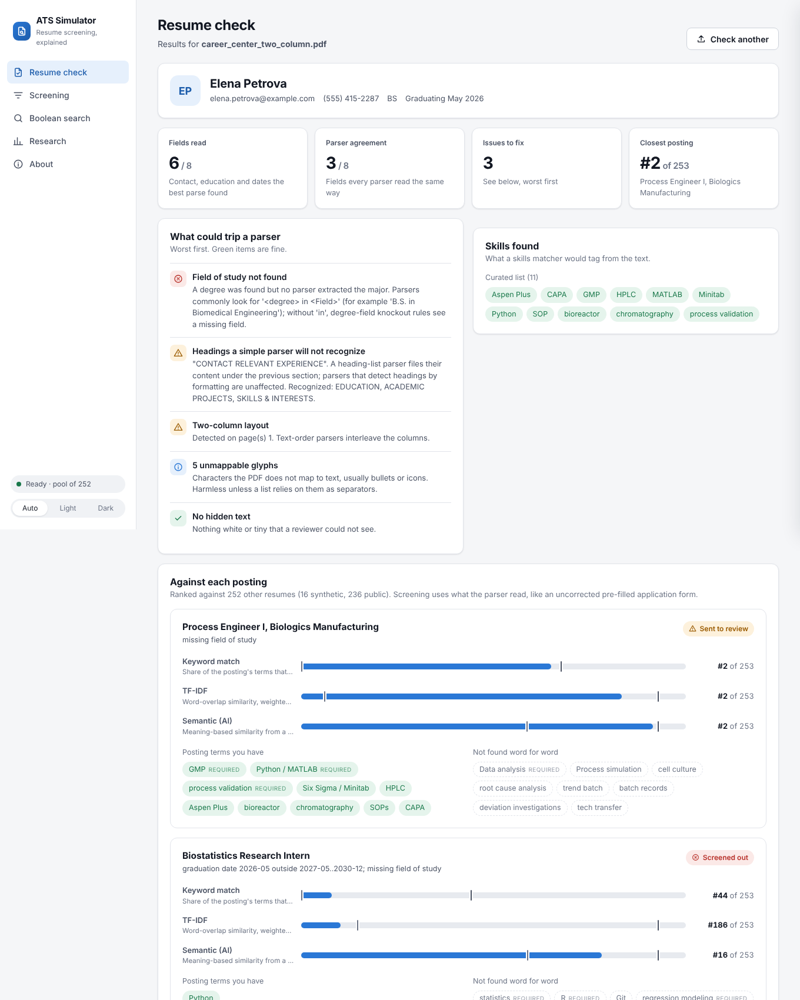

A desktop-style app for checking a resume and exploring how screening works. It runs entirely on your computer: uploaded resumes are read, analyzed and deleted, and the server only listens on 127.0.0.1.

| Screen | What it does |
|---|---|
| **Resume check** | Drop in a PDF or Word resume and paste the job description you want (or use the sample postings). For a pasted posting, a *Match for this job* panel shows the screening rules read from its text (degree, field, GPA, graduation window, work authorization, sponsorship) checked against your resume with the sentence each came from, your score and rank with each scorer, and the required and preferred terms found and missing. Tabs below hold an overview (parsing checks, worst first, including a visual check that reads the rendered page with OCR and flags text an ATS cannot read; and skills found), job matches (screening result and percentile rank per scorer for every posting, including one you paste in, expandable to the terms found and missing), a parser-by-parser comparison, the extracted text, and **Teach the model** (see [Learning from each resume](#learning-from-each-resume)) |
| **Screening** | The recruiter's view: 16 fictional candidates screened and ranked. Switch template, layout, file format or parser and watch who gets screened out; click a candidate to compare what the parser read with what the resume says |
| **Boolean search** | Recruiter-style keyword queries with AND, OR, NOT, quotes and parentheses |
| **Research** | The headline findings, drawn as interactive charts (hover for values and 95% intervals, or switch any chart to a table) |

**Download it (no Python needed)**

The app is built as a single program for each operating system by GitHub Actions ([desktop app workflow](.github/workflows/desktop.yml)):

1. Download the file for your system from the [latest release](https://github.com/shreyosecret/ATSResumeFilter/releases/latest). (Builds of unreleased changes are under the **Actions** tab, in each successful *desktop app* run's **Artifacts**.)
   - **Windows:** `ATS-Simulator-Windows.zip` holds `ATS-Simulator.exe`.
   - **macOS (Apple Silicon):** `ATS-Simulator-macOS-AppleSilicon.zip` holds `ATS Simulator.app`.
   - **macOS (Intel):** `ATS-Simulator-macOS-Intel.zip` holds `ATS Simulator.app`.
   - **Linux:** `ATS-Simulator-Linux.zip` holds `ATS-Simulator`.
2. Unzip and double-click. The builds are not signed with a paid developer certificate (see [Signing the builds](#signing-the-builds)), so the system will warn you the first time:
   - **Windows SmartScreen:** click *More info*, then *Run anyway*.
   - **macOS:** right-click the app, choose *Open*, then confirm (or allow it in System Settings, Privacy & Security).
3. The first launch takes about 20 seconds. The learned parser's starting model ships inside the download, so it is ready at once. Later launches are faster.

Each download is about 340 to 445 MB. It contains Python, every library, the MiniLM language model and the OCR models. The semantic scorer runs that model through onnxruntime instead of PyTorch: same weights and same output (within 2e-7), at a fraction of the size. The app opens in its own window on Windows and macOS, and in your browser on Linux. A browser-mode app quits on its own a few minutes after you close its tab. Your data, the learned model and a log file are kept in `~/.ats_sim` (or `%APPDATA%\ats_sim` on Windows). The app never goes online unless you turn on *Check for new versions* in About; then it asks GitHub for the latest version number and nothing else.

**Signing the builds**

Unsigned builds work but warn on first launch. The desktop workflow signs them automatically once certificates are added as repository secrets (Settings, Secrets and variables, Actions); until then those steps do nothing. These steps have not been run with real certificates yet, so check the first signed build.

- **Windows:** `WINDOWS_CERT_PFX_BASE64` (a code-signing certificate as a base64 `.pfx`) and `WINDOWS_CERT_PASSWORD`.
- **macOS:** `APPLE_CERT_P12_BASE64` (a *Developer ID Application* certificate as a base64 `.p12`), `APPLE_CERT_PASSWORD`, `APPLE_ID`, `APPLE_TEAM_ID` and `APPLE_APP_PASSWORD` (an app-specific password), from an Apple Developer Program membership. The app is signed, notarized and stapled.

**Run it from the source**

- Double-click `launchers/ATS Simulator.command` (macOS) or `launchers/ATS Simulator.bat` (Windows), or run `bash launchers/run.sh` (Linux). The first run creates a private Python environment and installs everything (a few minutes, once); later runs open in seconds.
- Or by hand: `pip install -e ".[embeddings,desktop]"`, `python -m spacy download en_core_web_sm`, then `ats-sim`.

With `pywebview` installed (the `desktop` extra) the app opens in its own window; otherwise it opens in your browser. `ats-sim --browser` forces the browser. Light and dark themes follow the system, with a toggle. The interface uses the Inter typeface (SIL Open Font License), bundled so the app works offline. The first launch takes about a minute while the language model indexes the comparison resumes; that index is cached, so later launches take seconds. The open-source parsers and SkillNer appear automatically when installed (`scripts/setup_external.sh`).

<table><tr>
<td>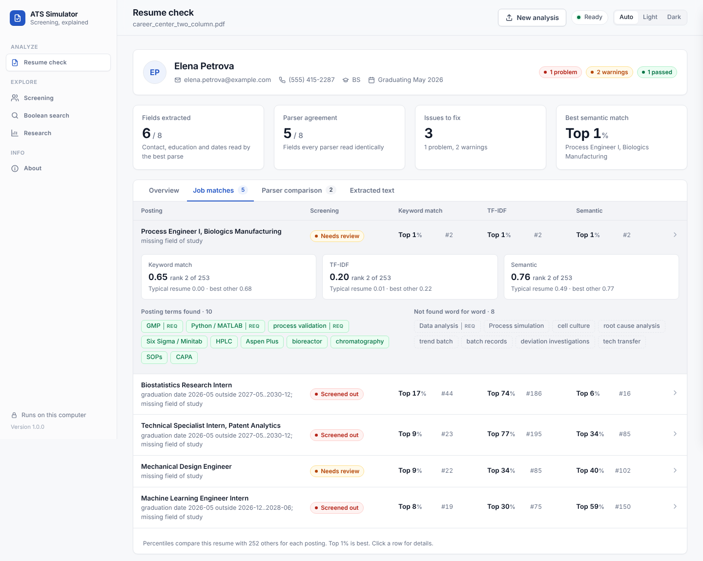</td>
<td>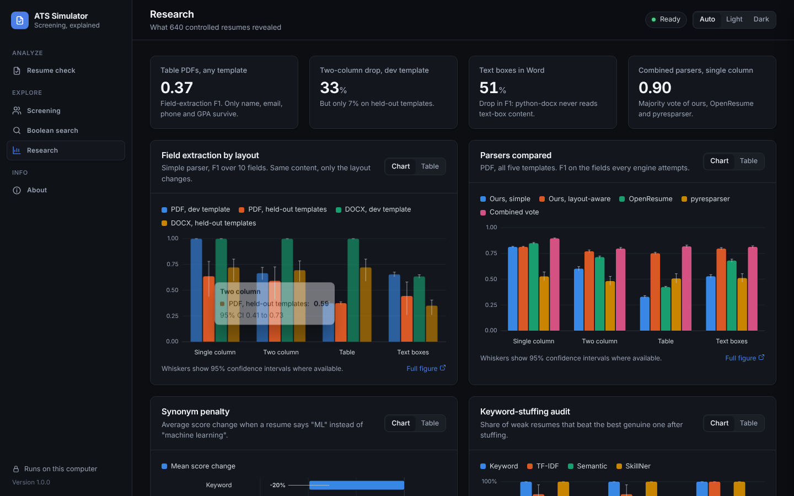</td>
</tr><tr>
<td>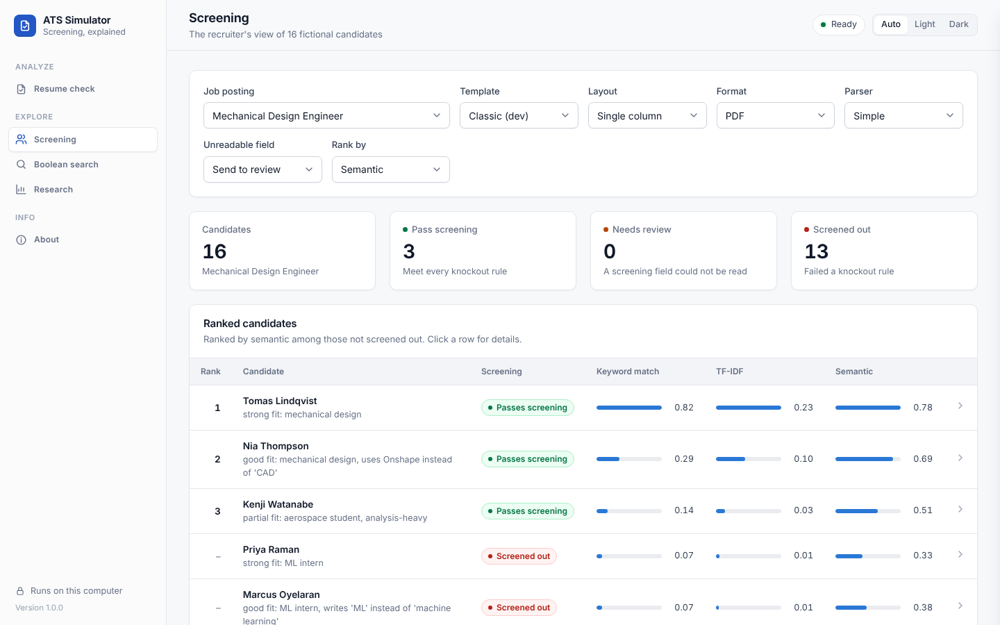</td>
<td>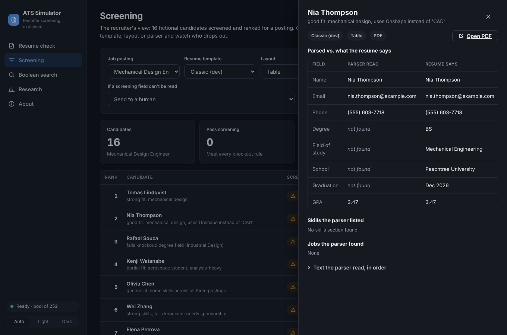</td>
</tr></table>

**Shipping notes.** The stand-alone builds come from `packaging/ats_sim.spec` (PyInstaller); `python scripts/fetch_minilm_onnx.py --out build/minilm-onnx && pyinstaller packaging/ats_sim.spec` builds one locally for the system you run it on. They are not code-signed, which is why the operating system warns on first launch; signing needs paid Apple and Windows developer certificates. There is no Intel-Mac build yet. Without the `embeddings` or `onnx` extra, a source install still works, using a lighter LSA fallback that it labels as such. The older Streamlit developer dashboard is still available with `streamlit run app.py`.

## What it models (and what it deliberately does not)

The popular claim that "75% of resumes are auto-rejected by robots" has no solid study behind it. Documented ATS behavior comes down to three things, and the simulator models exactly those:

| Stage | Real-world behavior | Here |
|---|---|---|
| **Parse** | Turn the file into fields (contact, education, experience, skills) | `ats_sim/parser.py`: pdfplumber / python-docx, heading detection, regex fields. Two reading-order modes: naive (text order) and layout-aware (tables, boxes, columns) |
| **Knockout** | Reject on application questions: work authorization, graduation date, minimum GPA, degree field | `ats_sim/knockout.py`: rule-based, with an explicit policy for fields the parser could not find |
| **Search and rank** | Recruiters run Boolean keyword searches; some newer systems add a match score | `ats_sim/search.py` (Boolean top-k) and `ats_sim/scorers.py` (keyword, TF-IDF, embedding) |

There is **no single magic score that rejects people**. Scores only order candidates who passed the knockouts. A human decides what happens next.

Knockouts are usually application-form questions, not resume parsing. Many forms are prefilled from the parse, though, and a candidate who does not correct the autofill is screened on what the parser extracted. The default here reads education fields from the parse (the uncorrected-autofill case). Work authorization always comes from the candidate's answers, because no parser can know it.

## Quick start

```bash
pip install -r requirements.txt
python -m spacy download en_core_web_sm

python scripts/build_corpus.py                 # 16 personas x 5 templates x 2 formats x 4 layouts = 640 resumes
python scripts/run_experiments.py --require-minilm      # results/ (fails rather than falling back to LSA)
ats-sim                                        # the app (after pip install -e ".[embeddings,desktop]")
streamlit run app.py                           # older developer dashboard
python scripts/learning_curve.py               # experiment 5: results/learning/ (about 15 minutes)
python scripts/format_diversity.py             # experiment 6: results/formats/ (50 generated formats)
python scripts/geometry_ablation.py            # experiment 7: results/geometry/ (about an hour)
pytest                                         # 158 tests (also run by GitHub Actions on every push)

# optional: rerun the ranking experiments with ~190 public resumes as distractors
python scripts/fetch_public_resumes.py         # CC0 dataset, no Kaggle account needed
python scripts/run_experiments.py --require-minilm --public-pool data/kaggle/Resume.csv --out results/public_pool

# optional: open-source engines (OpenResume, pyresparser, SkillNer), then benchmark and check a resume
bash scripts/setup_external.sh                 # prints OPENRESUME_DIR and PYRESPARSER_PYTHON to export
python scripts/benchmark_parsers.py            # results/parsers/
python scripts/run_experiments.py --require-minilm --with-skillner
python scripts/check_resume.py my_resume.pdf   # report in private/ (gitignored)
```

The first run downloads `all-MiniLM-L6-v2` (about 90 MB). Without `--require-minilm`, a failed download falls back to an LSA embedding with a warning, and every chart and table is labeled with the backend actually used. All committed results use MiniLM.

## Pipeline

1. **Parser** (`parser.py`). A line counts as a section heading only if it is a known heading on its own line; fields come from regexes inside the detected sections. Two reading-order modes share those exact rules:
   - *naive*: pdfplumber's text order for PDF; body paragraphs and tables for DOCX (like many simple readers, no text boxes, headers or footers).
   - *layout-aware*: ruled tables are read cell by cell, bordered boxes as blocks, and a column gutter, if found, splits the page so the left column is read before the right. Boxes floating beside the main text are read after it. DOCX text boxes are read after their anchor paragraph.
2. **Job description analyzer** (`jd.py`). Splits a posting into Requirements / Preferred / Responsibilities, finds skills from the curated list in `data/skills.json`, and adds spaCy noun phrases as lower-weight uncurated terms. It handles "Python or MATLAB" as alternatives and demotes skills after cues like "ideally" or "a plus". Degree and graduation lines feed the knockouts, not the skill list.
3. **Knockout filter** (`knockout.py`). Graduation window, minimum GPA, minimum degree level, accepted degree fields, work authorization and sponsorship. A field the parser could not find becomes `REVIEW` (default), `REJECT`, or `PASS`, depending on `missing_policy`.
4. **Scorers** (`scorers.py`).
   - *Keyword*: share of the posting's terms present verbatim (required weighs 2, preferred 1, noun phrases half). Presence is binary, so repetition does not help.
   - *TF-IDF*: cosine similarity, unigrams and bigrams, fit once on the pool so variants never change the IDF weights.
   - *Embedding*: `all-MiniLM-L6-v2`. The text is split into line chunks (long lines are windowed to 40 words), each chunk is embedded, and the vectors are mean-pooled. Chunking avoids the model's 256-token limit, which would otherwise silently drop most of a resume.
   - *Keyword+taxonomy* (reference only): keyword match that also accepts curated aliases and narrower tools ("ML" counts as "machine learning", "Onshape" as "CAD").
5. **Recruiter search** (`search.py`). `(Python OR MATLAB) AND "GMP" NOT intern`, with implicit AND, `-term`, phrases and parentheses. Results are ranked by log-damped term counts. Synonym expansion is optional.
6. **Report** (`app.py`). A Streamlit dashboard: pick a posting, layout, format, template and parser mode, then see each resume's parsed fields next to its answer key, the raw text the parser saw, knockout result, three scores, ranks, live Boolean search, and the experiment charts. You can upload your own resume; it is parsed in the session and deleted.

## Data

- `data/personas.json`: 16 synthetic, fictional candidates written for this project (example.com emails, 555 phone numbers, invented schools and employers). They span ML, bioprocess, mechanical and off-domain profiles, and include deliberate edge cases: a missing GPA, a sponsorship need, a late graduation date, a non-matching degree, and candidates who write "ML" or "Onshape" instead of the posting's wording. **This file is the hand-written answer key** for field extraction.
- Five templates, rendered by `ats_sim/render.py`. The same content goes into each:

  | Template | Status | Modeled on | Conventions |
  |---|---|---|---|
  | **classic** | development | (the parser was written against it) | ALL-CAPS headings, "B.S. in Field", "Title \| Company \| dates" |
  | **modern** | held out | designer-style templates | title-case headings, profile summary, contact icons, "Bachelor of Science, Field", right-aligned dates, grouped skills, "Skills & Certifications" heading |
  | **latex** | held out | the popular one-page LaTeX student template | school \| location and degree \| date-range rows, title \| dates then company \| location, "Technical Skills" by category |
  | **career_center** | held out | university career-center handouts | "RELEVANT EXPERIENCE", company line then title line, GPA inside the degree line, one line of "Label: items;" skill groups |
  | **hybrid** | held out | skills-first functional/hybrid resumes | qualifications summary, one bullet per skill under "Core Competencies", seasonal dates ("Summer 2025"), year-only graduation, "Education & Certifications" |

  The held-out templates were written after the parser's field rules were frozen, and those rules were never changed afterwards. The templates were chosen for realism, not to make the parser fail, but they were written by someone who knew the parser, so treat them as a convenience sample of real conventions, not a random draw. Tests fail if the parser is ever tuned to them.
- `data/samples/`: one candidate in every template and layout (20 PDFs) to browse on GitHub. `data/resumes/` (all 640 files) is generated by `build_corpus.py` and not committed.
- `data/jobs/*.json`: three synthetic postings (ML intern, biologics process engineer, mechanical design engineer), each with knockout rules.
- **Public resumes (optional).** `scripts/fetch_public_resumes.py` downloads the Kaggle "Resume Dataset" (snehaanbhawal/resume-dataset, CC0 1.0) from its Hugging Face mirror into the gitignored `data/kaggle/`. 186 resumes from the Engineering, IT, Aviation and Automobile categories join every ranking pool as distractors. They have no layout and no answer key, so they never enter the layout experiment, and nothing derived from an individual resume is committed. No LinkedIn scraping, and no real resumes used without permission.

## Results

All numbers come from `results/RESULTS.md` (16-resume pool) and `results/public_pool/RESULTS.md` (202-resume pool), produced by `scripts/run_experiments.py` with all-MiniLM-L6-v2. Brackets are 95% bootstrap confidence intervals (2,000 resamples). For a single template they resample the 16 personas; for the pooled held-out templates they resample templates and then personas. Drops are paired against the same personas' single-column results.

### 1. Layout robustness: the strongest result

640 resumes: 16 personas x 5 templates x 2 formats x 4 layouts, each read by both parser modes, micro-F1 over 10 fields.

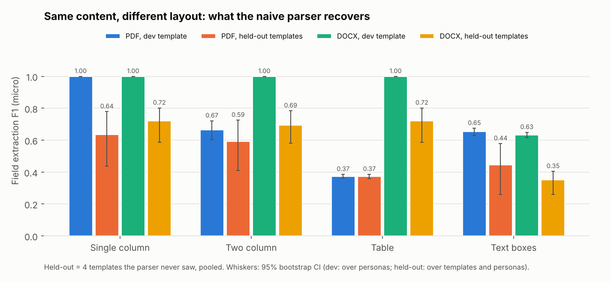

Naive parser, PDF, F1 by template (drop vs. the same template's single column in parentheses):

| Template | Single column | Two column | Table | Text boxes |
|---|---|---|---|---|
| classic (dev) | 1.00 | 0.67 (-33%) | 0.37 (-63%) | 0.65 (-35%) |
| modern | 0.51 | 0.49 (-4%, n.s.) | 0.37 (-27%) | 0.29 (-44%) |
| latex | 0.74 | 0.70 (-5%) | 0.37 (-50%) | 0.54 (-27%) |
| career_center | 0.81 | 0.74 (-9%) | 0.37 (-54%) | 0.60 (-25%) |
| hybrid | 0.36 | 0.33 (-7%) | 0.37 (+5%) | 0.24 (-34%) |
| **held-out, pooled** | **0.64 [0.44, 0.78]** | **0.59, -7% [2, 11]** | **0.37, -41% [15, 52]** | **0.44, -30% [25, 41]** |

DOCX: single column, two column and table parse the same as single column in every template except hybrid two-column (-15%). DOCX text boxes cost 24% to 74% (pooled -51% [35, 66]).

What holds across templates, and what does not:

- **Tables are the most robust finding.** A table PDF scores 0.37 in every template: only name, email, phone and GPA survive, because the section label and its content share a line ("EDUCATION B.S. in Computer Science") and no section is ever detected.
- **Text boxes cost 25% to 44% as PDF and 24% to 74% as DOCX in every template.** In PDF the contact box shares lines with the name; python-docx never sees text-box content at all, so contact details and skills disappear.
- **The two-column penalty is template-dependent, and the 33% from the development template was the outlier.** On held-out templates two-column PDFs cost 4% to 9% (pooled 7%). The development template is the only one the parser reads perfectly, so it had the most to lose. On the others, wording conventions had already cost the fields that column interleaving breaks (experience, skills), and a field can only be lost once.
- **But two-column still breaks the fields that knockouts depend on** (see below). In latex and career_center the degree and its date share a row; squeezed into a narrow sidebar it wraps, and the interleaved reading pulls a job date into the education section as the graduation date.
- **Format matters as much as layout.** Two-column and table designs saved as DOCX parsed like single column, because Word tables are read cell by cell in order.
- **Wording conventions matter as much as layout.** Single-column F1 ranges from 0.36 to 1.00 across templates. Each held-out template trips different rules: "Bachelor of Science, Field" (no "in") hides the field of study, "Title, Company" or a company line above the title hides the employer, seasonal dates ("Summer 2025") and year-only graduation dates are not parsed, and "Skills & Certifications" or "Education & Certifications" are not recognized as headings.

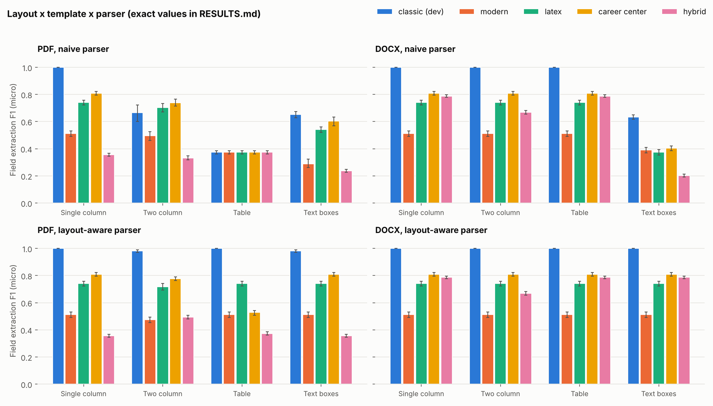

A note on `(cid:127)`: that is how pdfminer prints a bullet glyph it cannot map to Unicode. It does not matter for comma-separated skills, but in the hybrid template, which lists one skill per bullet, the PDF bullets cannot act as separators and the whole list becomes one garbage item. That is why hybrid single column scores 0.36 as PDF but 0.79 as DOCX, where the bullet is a real "•". Real PDFs vary in how their bullets extract; this generator's do not.

#### A layout-aware parser

The layout-aware mode reads tables cell by cell, boxes as blocks, and detected columns one at a time, with the same field rules.

| Pooled held-out templates | Naive | Layout-aware |
|---|---|---|
| PDF table | 0.37 | 0.56 |
| PDF text boxes | 0.44 | 0.64 (= single column) |
| PDF two column | 0.59 | 0.63 |
| DOCX text boxes | 0.35 | 0.72 (= single column) |

It recovers most of the layout loss in every template (classic tables 0.37 to 1.00, two columns 0.67 to 0.98), but it cannot fix wording: a layout scores above its template's single column only by accident (hybrid two-column reaches 0.49 against 0.36, because text from an unrecognized summary section happens to land in the skills list). In one case it makes things slightly worse: modern two-column falls from 0.49 to 0.47, because clean reading order lets the parser find every "Title, Company" line and misread each one. Better reading order can turn misses into confident wrong answers.

**Bugs found by the new templates (disclosed because they affect what is held out).** Evaluating on latex and career_center exposed two flaws in the layout-aware column detector: it mistook right-aligned dates for a second column, and it accepted a "gutter" that cut through a long wrapped line. Both were fixed with general typesetting rules (body-text columns are left-aligned; a gutter never splits a line of continuous text), and a test now requires layout-aware and naive reading to agree on every single-column resume in every template. Before the fix, layout-aware single-column F1 was 0.70 for latex and 0.74 for career_center (now 0.74 and 0.81, equal to naive). Because the fix was prompted by these templates, the layout-aware numbers above are not strictly held out; the naive parser, which carries every other claim, was not changed. A renderer bug that dropped bullet markers from DOCX text boxes (hybrid only) was also fixed.

#### Downstream effects: keyword search vs. knockouts

- **Keyword search barely notices layout.** The mean keyword-score change was between 0.000 and -0.026 for every layout, template and format. Words survive in the raw text even when structure does not.
- **Knockouts notice.** Under a "missing field = reject" policy, the 9 qualified candidate x posting pairs that pass as single column were handled like this:

  | Template | Table PDF | Two-column PDF | Text-box PDF |
  |---|---|---|---|
  | classic | 9 of 9 rejected | 1 of 9 rejected | 0 |
  | latex | 9 of 9 rejected | 9 of 9 rejected | 0 |
  | career_center | 9 of 9 rejected | 9 of 9 rejected | 0 |
  | modern, hybrid | n/a: all 48 pairs rejected even as single column | | |

  Under the gentler "missing field = human review" policy, the same failures mostly send candidates to review instead, which also lets unqualified candidates through the screen (34 REJECT -> REVIEW for classic tables).
- **Single column is necessary, not sufficient.** With the modern and hybrid templates, every candidate was rejected under the strict policy even as a clean single-column PDF, because the degree field could not be read.

### 2. Synonym sensitivity

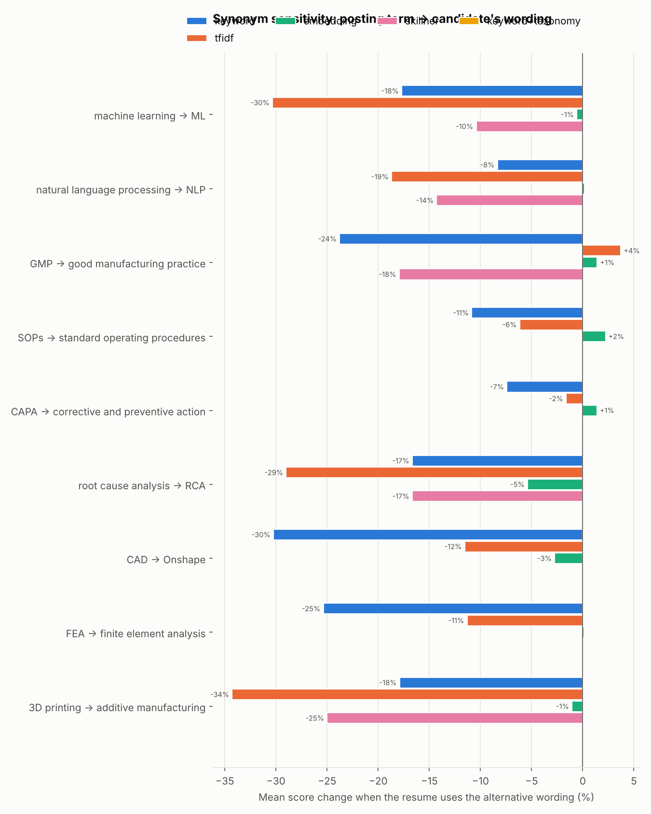

21 cases across 9 term pairs (posting wording vs. a common alternative, both directions).

| Scorer | Mean score change [95% CI] | Dropped in rank (16-pool) | Dropped in rank (202-pool) |
|---|---|---|---|
| Keyword (exact) | -20% [-24, -16] | 48% | 62% |
| TF-IDF | -16% [-23, -9] | 24% | 29% |
| Embedding (MiniLM) | **-0.3% [-1.3, +0.6]** | 10% | 29% |
| Keyword + taxonomy | 0% | 0% | 0% |

Exact matching is the most brittle: "Onshape" instead of "CAD" cost 30%, "FEA" vs "finite element analysis" 25%. MiniLM's score barely moved for any pair, and a curated alias list fixes keyword matching completely. In the larger pool, even MiniLM's tiny shifts move some resumes, because scores there are tightly packed.

### 3. Keyword-stuffing audit

This is an **audit of weak scoring methods**, not a guide to gaming them. Every attack below is trivially caught by a human reader or by a one-line parser fix, and it misrepresents the candidate.

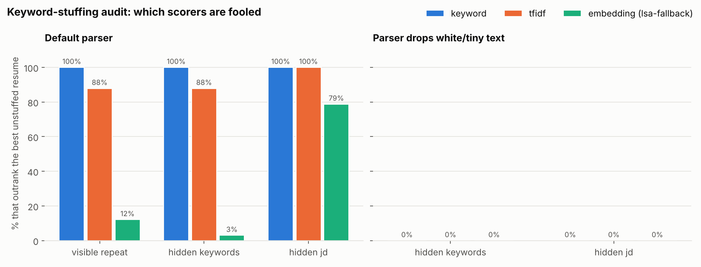

For candidates who started outside the top 5, the share whose stuffed resume outscored the best *unstuffed* resume in the pool:

| Attack | Keyword | TF-IDF | Embedding (MiniLM) |
|---|---|---|---|
| Visible repeated keyword list | 100% | 88% [76, 97] | **0%** |
| Same list in white text | 100% | 88% [76, 97] | **0%** |
| Whole posting pasted in white text | 100% | 100% | **42% [27, 61]** |
| Either hidden attack, parser drops white text | 0% | 0% | 0% |

- Keyword and TF-IDF scorers are fooled by any added keyword list. Repetition specifically inflates TF-IDF (raw term counts); the presence-based keyword scorer is fooled by the first mention.
- MiniLM was never pushed past the best genuine candidate by a keyword list, though it still lifted weak resumes: 79 to 85% of them entered the top 5 in the 16-resume pool, and 30 to 45% in the 202-resume pool. A pasted copy of the posting beat the best genuine resume 42% of the time (48% [32, 62] in the larger pool). "Embeddings resist stuffing" is true for keyword lists, false for pasted postings.
- The effective fix lives in the parser, not the scorer: discarding white or tiny characters before scoring (`parse_resume(..., drop_invisible=True)`) neutralized both hidden attacks for every scorer. Nothing in a scorer can tell a visible keyword list from a real skills section; that is a human-review problem.

### 4. Ranking stability

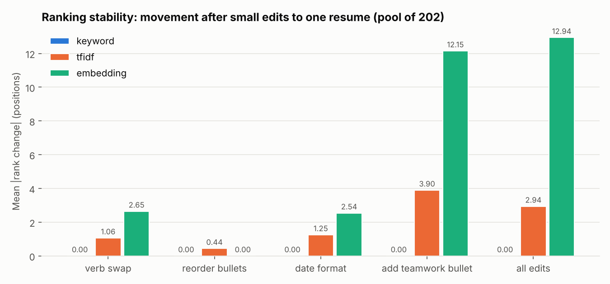

Each of 16 resumes got small wording edits (verb synonyms, reordered bullets, `Jun 2025` -> `06/2025`, one generic "collaborated with cross-functional teams" bullet, all combined) while the rest of the pool stayed fixed. 240 cases per scorer.

| Mean \|rank change\| | Keyword | TF-IDF | Embedding (MiniLM) |
|---|---|---|---|
| 16-resume pool, one generic bullet | 0 | 0.7 | 0.6 |
| 202-resume pool, one generic bullet | 0 | 3.9 | **12.2** (max 34) |
| 202-resume pool, verb synonyms | 0 | 1.1 | 2.7 |
| Top-5 changes, 202-resume pool | 0 | 4 | **7** |

- The keyword scorer never moved: none of the edits touched a skill term.
- **The scorer that best resists synonyms and keyword lists is the least stable ranker.** Mean-pooled embeddings shift with every sentence, so one generic bullet moved MiniLM rankings by 12 positions on average in a realistic pool. That would have been invisible in the 16-resume pool, where the same edit moved resumes less than one position.
- There is no free lunch: exact matching is stable but blind to synonyms; embeddings understand synonyms but react to filler.

## Open-source engines, mixed in

Three open-source projects are run alongside this project's own code. None of their code is stored in this repo: `scripts/setup_external.sh` downloads them, and small adapters in `ats_sim/engines.py` and `external/` run them and map their output into the same schema, using this project's own degree and date normalizers so every engine is scored by the same rules.

| Engine | License | What it is | How it runs here |
|---|---|---|---|
| [OpenResume](https://github.com/xitanggg/open-resume) | AGPL-3.0 | Resume builder whose parser students use to test "ATS readability". Groups text by font features (bold, capitals) rather than a heading list; documented as single-column only | Unmodified source, bundled at run time under Node by `external/openresume/run.mjs` |
| [pyresparser](https://github.com/OmkarPathak/pyresparser) | GPL-3.0 | The most widely used Python resume parser; spaCy 2 + NLTK + a keyword skills list | Isolated Python 3.8 environment, called as a subprocess (`external/pyresparser/run.py`) |
| [SkillNer](https://github.com/AnasAito/SkillNER) | MIT | Skill extraction against the EMSI/Lightcast open skills database (31,278 skills) | Imported directly; used as a fourth scorer |

### Parser benchmark

`scripts/benchmark_parsers.py` runs every parser on all 640 labeled resumes. Because engines format fields differently, scoring is lenient (a school with ", Raleigh, NC" still counts), and fields an engine never attempts are excluded rather than counted as misses (pyresparser has no graduation date or GPA field). The table uses only fields all engines attempt.

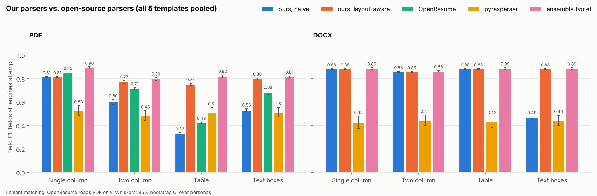

| PDF, all templates | ours, naive | ours, layout-aware | OpenResume | pyresparser | ensemble |
|---|---|---|---|---|---|
| Single column | 0.81 | 0.81 | 0.85 | 0.53 | **0.90** |
| Two column | 0.60 | 0.77 | 0.71 | 0.48 | **0.80** |
| Table | 0.33 | 0.75 | 0.42 | 0.51 | **0.82** |
| Text boxes | 0.53 | 0.80 | 0.68 | 0.51 | **0.81** |

- **OpenResume is the best single parser on clean single-column PDFs**, mainly because it finds experience entries (0.87 vs 0.44 for ours): it detects headings by formatting, so unfamiliar headings and line conventions in the held-out templates hurt it less (hybrid: 0.59 vs 0.33).
- **It breaks on tables (0.42) and degrades on two columns and text boxes**, as its own documentation warns. It also put a sidebar heading ("CONTACT") in the name field on two-column resumes, and glued the contact-icon glyph onto every modern-template email address ("npriya.raman@example.com").
- **pyresparser is weak on this corpus.** It dropped the area code from every phone number, returned no school for any of the 640 resumes, scored 0.03 F1 on experience entries, and its whole-text skill matching returns words like "Design" and "Process". Its reading order handles columns well (it uses pdfminer's layout analysis), which keeps it flat across layouts.
- **Mixing them works.** A field-by-field majority vote across our layout-aware parser, OpenResume and pyresparser (`engines.vote`) is the best or tied-best result in every layout. It keeps OpenResume's experience and skills, and falls back to our reading order where OpenResume breaks. The vote rule is generic, but it was written after seeing these results, so treat the ensemble numbers as in-sample.

Full tables, including per-template and per-field results: `results/parsers/PARSERS.md`.

### SkillNer as a fourth scorer

`run_experiments.py --with-skillner` scores resumes by the share of the posting's SkillNer skills that SkillNer also finds in the resume.

| | Keyword (64 curated skills) | SkillNer (31k skills) | Embedding (MiniLM) |
|---|---|---|---|
| Synonym penalty | -20% | -10% [-15, -6] | -0.3% |
| Fooled by a keyword list (beats best genuine resume) | 100% | 100% | 0% |
| Wording edits that changed rank | 0 | 0 | some |

A big taxonomy halves the synonym penalty (it maps "finite element analysis" to FEA and "SOPs" to SOP) but still misses "ML", "NLP", "GMP" spelled out, "RCA" and "additive manufacturing". It also brings noise: "B.S." matched "B (Programming Language)" and "Co-op" matched "Component Object Model". Being presence-based, it is as easy to stuff as exact matching and as stable under rewording.

## Learning from each resume

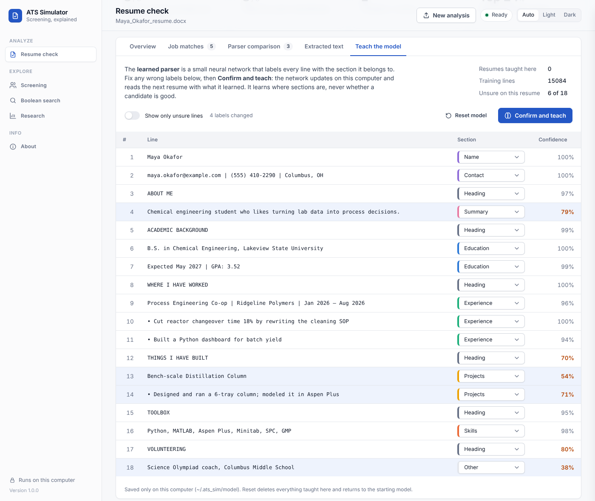

The app has a fourth parser that learns: a small neural network (`ats_sim/learn/`, scikit-learn `MLPClassifier`, one hidden layer of 64 units) that labels every line of a resume with its section (name, contact, heading, summary, education, experience, projects, skills, other). The field rules then run on the sections it found. Where the heading-list parser only knows the headings it was given, the network looks at the line, its neighbors, the nearest heading above it and the line's shape (bullets, dates, capitals), so it can follow headings it has never seen, such as "Where I have worked" or "Toolbox". A second, smaller network reads how each line looks on the page (size, weight, color, spacing, margins; see [experiment 7](#7-reading-the-page-geometry-designer-and-reference-formats)) and helps decide which lines are headings and which is the name.

**How it learns.** After an analysis, the *Teach the model* tab shows each line with the network's label and confidence (unsure lines in orange). Fix any wrong labels and click *Confirm and teach*: the network takes a few gradient steps on that resume (`partial_fit`), mixed with a random replay sample of earlier lines so a new resume does not overwrite what it already knew. The next resume is read with the updated weights. It starts from the synthetic corpus: the 640 resumes in the five templates plus about 2,700 files in [50 generated](#6-fifty-generated-formats), 12 designer and 22 reference formats. The desktop download ships this starting model already trained. A source install trains it on first launch, which takes 10 minutes or more in the background while the rest of the app works, then caches it. A starting model cached by an older version is rebuilt automatically.

**What it deliberately does not learn.** You asked for a network that learns from every new resume. I built it to learn only from resumes you confirm, and only where the sections are, for two reasons that the experiment below measures or that the literature already settled:

- *Learning from its own guesses drifts.* Without a person checking, the network trains on its own mistakes. In the experiment it helped on one template, did nothing on two, and made one worse, with a wide spread between runs. So nothing is learned unless you click the button.
- *Learning "good candidates" from outcomes copies bias.* Training a model on who got hired teaches it whatever produced those hires; Amazon scrapped a resume model in 2018 after it learned to penalize the word "women's". This network never sees a score, a rank or an outcome.

**Privacy.** The model lives in `~/.ats_sim/model` (or `%APPDATA%\ats_sim\model`; set `ATS_SIM_MODEL_DIR` to move it), never in the repository. Teaching stores the updated weights and a replay buffer of hashed line features (not the text, but derived from it). *Reset model* deletes both and returns to the starting model. `ats-sim --no-learning` turns the feature off. The learned parser is shown as its own column and kept out of the combined vote, the agreement count and the risk checks, so those match results from before any teaching. `python scripts/check_resume.py my_resume.pdf --learned` adds it to the command-line report.

**Sharing labels for research (optional).** *Export labels* in the Teach tab saves the resume's lines, the labels you confirmed and the page geometry to a JSON file, with the name, email addresses, phone numbers and links replaced by placeholders (`ats_sim/learn/export.py`). The rest of the text stays, since the labels describe it, so look the file over before sharing it. The app sends nothing. A folder of such files is the real-resume test set this project lacks: `python scripts/geometry_ablation.py --real-dir private/real` scores every version of the network on them and writes the result under `private/` only.

### 5. Learning a new template, one resume at a time

`scripts/learning_curve.py` trains the network on the classic template only, then treats each held-out template as new: 8 personas arrive one at a time (random layout and format), and after each one we measure on the other 8 personas in all 8 layout and format combinations (64 files). Five seeds vary the persona split, the order and the initial weights. Conditions: learning from corrections (the true labels, as a user would supply), learning from its own guesses (self-training), no learning, and the heading-list parser. "Perfect sections" parses with the true line labels and is the ceiling for any section tagger, because the field rules after it have their own misses.

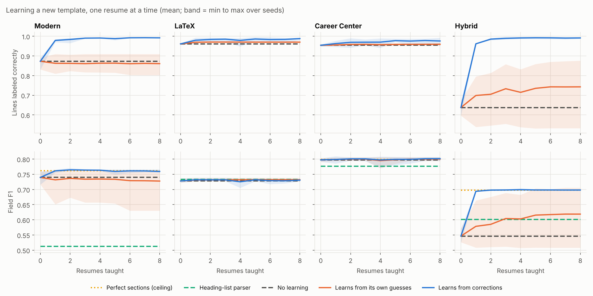

| Template | Lines right, start | After 1 correction | After 8 | After 8 of its own guesses | Field F1: heading list / start / after 1 / ceiling |
|---|---|---|---|---|---|
| Modern | 0.87 | 0.98 | 0.99 | 0.86 (0.80 to 0.91) | 0.51 / 0.74 / 0.76 / 0.76 |
| LaTeX | 0.96 | 0.98 | 0.99 | 0.97 | 0.73 / 0.73 / 0.73 / 0.73 |
| Career center | 0.95 | 0.96 | 0.98 | 0.96 | 0.78 / 0.80 / 0.80 / 0.80 |
| Hybrid | 0.64 | 0.96 | 0.99 | 0.74 (0.53 to 0.88) | 0.60 / 0.55 / 0.69 / 0.70 |

Means over 5 seeds; ranges are min to max. What this shows:

- **One corrected resume is most of the gain.** On the two templates the starting network reads worst, a single correction takes line accuracy from 0.87 and 0.64 to 0.98 and 0.96, and it generalizes to other people's resumes in that template, not just the one taught.
- **Field F1 hits the ceiling, and the ceiling is the field rules.** After one correction the learned parser matches "perfect sections" on every template. The remaining misses are in the regexes (for example, "B.S., Software Engineering" has no "in", so no field of study is found), which a section tagger cannot fix.
- **It beats the heading list where headings are unfamiliar** (Modern: 0.76 vs 0.51) and ties it where they are familiar (LaTeX). Before any teaching it is *worse* than the heading list on Hybrid (0.55 vs 0.60), so the starting network is not a free upgrade.
- **Self-training is unreliable.** On Modern, 4 of 5 runs ended with lower line accuracy than they started with. On Hybrid it helped on average (0.64 to 0.74), but 2 of 5 runs ended below their start (0.60 to 0.53 in the worst). Its Hybrid F1 (0.62) stays under what one correction gives (0.69).
- **No forgetting.** After learning each new template, classic-template F1 stayed at 0.99 under every condition, thanks to the replay buffer.

Caveats: these templates are synthetic and the labels are exact, so a real user's corrections will be noisier. The starting network in the app is trained on all five templates, which makes it better on them than the classic-only network above. On one real resume (the author's), the starting network found the projects under "TECHNICAL PROJECTS", a heading the heading list does not know, but called the summary paragraph experience and spread a publications list across experience and education, which is exactly what the Teach tab is for.

### 6. Fifty generated formats

Real resumes from strangers cannot be used without permission, so the variety comes from a generator instead. `ats_sim/formats.py` draws 50 formats from a seed. Each one picks:

- a content style (one of the five templates' line styles);
- heading wording and capitalization ("Where I Have Worked", "DEGREES", "Toolbox:");
- section order, and an optional summary or objective;
- up to three extra sections that hold no parsed field (publications, leadership, awards, volunteering, certifications, languages, interests);
- the bullet character (including none, and "▪", which standard PDF fonts turn into "n", a real glyph failure), date style, contact style and font.

Each format is rendered for all 16 personas in 2 random layout and file-type combinations, for 1,600 files. The list, with the designer and reference formats, is in [results/formats/formats.csv](results/formats/formats.csv).

`scripts/format_diversity.py` trains the network on the classic template plus k of the 40 training formats and tests on what it never saw. The fair test is the four hand-written templates, which were written separately from the generator. A second test, the 10 held-out generated formats, comes from the same generator and is expected to look better. Personas are split too (10 train, 6 test), so no test resume belongs to a person the network trained on. Three seeds.

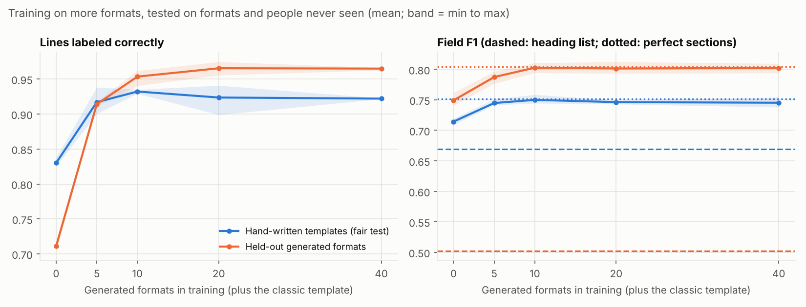

| Formats in training | 0 | 5 | 10 | 20 | 40 |
|---|---|---|---|---|---|
| Hand-written templates: lines right | 0.83 | 0.92 | 0.93 | 0.92 | 0.92 |
| Hand-written templates: field F1 (heading list 0.67, ceiling 0.75) | 0.71 | 0.75 | 0.75 | 0.75 | 0.75 |
| Held-out generated formats: lines right | 0.71 | 0.91 | 0.95 | 0.97 | 0.97 |
| Held-out generated formats: field F1 (heading list 0.50, ceiling 0.81) | 0.75 | 0.79 | 0.80 | 0.80 | 0.80 |

- **More formats help, but only the first ten or so.** On the hand-written templates, line accuracy goes from 0.83 to 0.93 by 10 formats and then flattens (0.92 at 40). Field F1 reaches the perfect-sections ceiling (0.75) by 5 to 10 formats, so the tagger is no longer what limits field accuracy.
- **The biggest gain is the template the classic-only network read worst:** Hybrid lines 0.61 to 0.87, field F1 0.54 to 0.68, now above the heading list (0.60), where before it was below.
- **The generator flatters itself.** Held-out generated formats reach 0.97, against 0.92 on hand-written templates. That gap is the cost of all the variety coming from one generator. Use the hand-written number when you quote this.
- **Past 10 formats, more of the same generator does not add new information.** Hand-written accuracy dips slightly from 10 to 40 formats (within the seed range). The next gain would need formats from a different source, such as real resumes that people consent to share. Corrections in the Teach tab supply exactly that.

**On one real resume.** I hand-labeled every line of one real student resume (the author's own, kept out of the repository) and compared the app's starting models. The model trained on the five templates labeled 54% of lines correctly. The one trained on the five templates plus the 50 formats labeled 71%. Its main error, filing publications and leadership lines under experience, fell from 24 lines to 7. That is one resume, and its labels came from the same person who wrote the generator, so read it as a sanity check, not a measurement.

Experiments 5 and 6 were run with the text-only network, before page geometry existed. The app's starting model now also trains on the designer and reference formats below.

### 7. Reading the page: geometry, designer and reference formats

**What was added.**

- `ats_sim/learn/geometry.py` measures every line from the smallest unit the file offers. In a PDF that is each character's position, size, font and color. In a Word file it is paragraph and run formatting. From those it computes the line's left margin and indent, size relative to body text, bold, italic, color, letter spacing, gaps above and below, right alignment, a rule under it, and whether it sits on a shaded panel, in a table or in a box. Before measuring, it joins lines that the PDF wrapped back into the bullet or paragraph they came from: a PDF stores each visual line separately, so a two-line bullet would otherwise be read as two items. A line is joined to the one above when it sits directly below in the same size and weight, starts where that bullet's text starts, is not a new bullet, a `Label:` line, contact details or a line starting with a past-tense verb, and its first word would not have fit at the end of the line above (word wrap only moves a word down when it does not fit). A line with a right-aligned date or place is never extended. With `read(path, merge_wrapped=False)` it returns exactly the lines the text reader produces, verified on 420 files. The rule-based parsers still read the raw lines, as a real ATS's text extraction does; joined lines are used by the learned parser and shown in the Teach tab. The *Extracted text* tab shows the raw extraction on purpose, because that is what an ATS sees.
- **12 designer formats** (d01 to d12) imitate the visual habits of drag-and-drop builders such as Canva. They are implemented from a description, without copying any template, because Canva's license forbids reusing its templates: letter-spaced and colored headings with rules, a large name with a one-line title under it, skills with rating dots, and shaded sidebars.
- **22 reference formats** (r01 to r22) follow the exact headings and section order of public templates, each mapped onto the closest entry style here. Every source and license is listed in [data/format_sources.json](data/format_sources.json). Only structure is used; no template text or code is copied. The sources are:
  - open-source templates whose licenses allow reuse: Jake's Resume (MIT), Awesome-CV (LPPL), Deedy-Resume (Apache-2.0), moderncv (LPPL), six RenderCV themes (MIT) and a JSON Resume theme (MIT);
  - five Google Docs gallery templates, described from public articles because Google publishes no open-source resume template, so their order and date style are approximate;
  - Harvard, MIT, UC Berkeley and Purdue career-center samples.

**The experiment.** `scripts/geometry_ablation.py` trains three versions of the network on the classic template plus 40 generated and 8 designer formats, for 10 of the 16 personas. It tests them on the other 6 personas in formats none of them trained on. The reference formats are held out entirely. Three seeds.

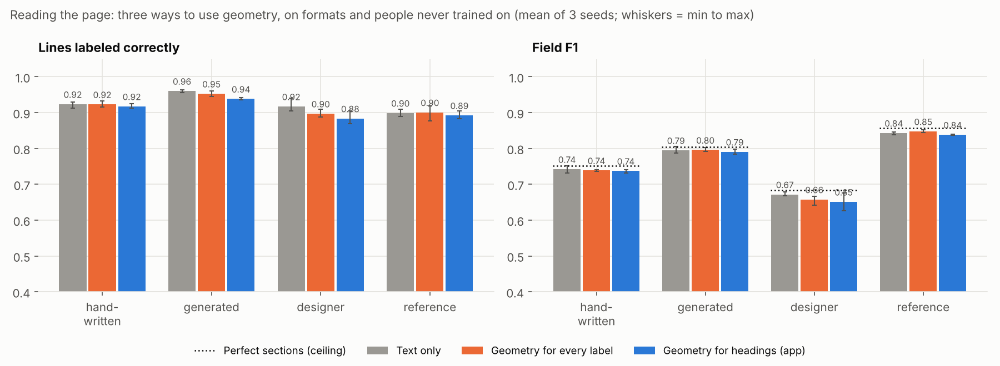

| Lines labeled correctly (mean of 3 seeds) | Text only (app) | Geometry for every label | Geometry for headings |
|---|---|---|---|
| Hand-written templates | 0.93 | 0.94 | 0.91 |
| Held-out generated formats | 0.97 | 0.97 | 0.96 |
| Held-out designer formats | 0.92 | 0.92 | 0.89 |
| Reference formats (public templates) | 0.92 | 0.92 | 0.91 |
| One real resume, hand-labeled (see below) | **0.83** | 0.69 | 0.81 |

These are from the rerun on the current reader (wrapped lines joined, font-relative word gaps). Field F1 tells the same story: text only is best or tied in every group (0.68 to 0.84), the headings version 0.006 to 0.03 lower.

**What happened, in order.** The order matters more than the final table:

1. **The first version looked like a clear win on synthetic data.** Geometry for every label raised line accuracy from 0.89 to 0.95 on the reference formats and from 0.91 to 0.94 on designer formats.
2. **On a real resume it was much worse.** It got 0.52 of lines right, against 0.69 for text only (three seeds), on a hand-labeled two-page student resume (the author's own, kept out of the repository). Every line it got wrong was on page 2. All synthetic resumes are one page, so the page-number feature never varied in training, kept its random starting weights, and pushed every page-2 line toward "experience".
3. **Fix:** remove page number and height on the page, and train on a second, randomly perturbed copy of each resume's geometry. This closed most of the gap on the real resume but erased the synthetic gains (the table's middle column). In other words, much of the early gain was the network recognizing this project's own renderer.
4. **The remaining real-resume errors were a layout shortcut.** In synthetic resumes an indented bullet line in the body is almost always experience, so the publications list was filed under experience regardless of its heading.
5. **The hybrid design:** the text network assigns sections and a small geometry network only finds headings and the name; their heading and name probabilities are averaged. On synthetic formats it was 1 to 3 points below text only, but on the real resume it was the best of the three in every seed (0.69 to 0.86), so it became the app's default.
6. **Joining wrapped lines changed the answer.** After the reader joined wrapped bullets back together (v1.3.1) and stopped gluing words in tightly set text (experiment 8), the experiment was rerun. On the real resume, text only went from 0.71 to 0.83 and matched or beat the hybrid in every seed (0.81 to 0.85, against 0.76 to 0.85); on every synthetic group it was best or tied. The likely reason: the hybrid's advantage came from lines the text network could not label alone: the second half of a wrapped bullet ("users", "backend") has no section words in it. Once those halves were joined to their bullets, the extra network no longer helped. The app now uses text only.

**What to take from it.**

- A model evaluated only on synthetic data would have shipped the worst of the three versions. Geometry measured on documents from one renderer partly learns that renderer.
- Fixing what the network reads mattered more than giving it more to read: joining wrapped lines improved the real resume by 12 points, more than any use of geometry did.
- The app uses text only. That choice rests on one real resume, which was also used to find the bugs above, so it is weak evidence; the synthetic results agree with it. Set `ATS_SIM_TAGGER=headings` (or `geometry`) to use another version; whichever runs, corrections in the Teach tab adapt it. Page geometry is still measured, and still used for joining lines and by the visual check.
- On the reference formats the heading-list parser is nearly as good (field F1 0.82, against 0.84 for the networks and a ceiling of 0.86). Real templates mostly use headings the list already knows. The networks matter most for designer formats and unusual headings (0.51 to 0.67).

### 8. Reading the page as an image: OCR vs small vision-language models

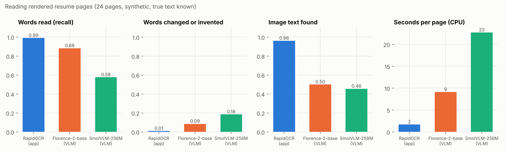

An ATS reads the text stored in a PDF; a recruiter reads the rendered page. The app now compares the two (`ats_sim/visual.py`): it renders each page, reads it with OCR, lines the two readings up letter by letter, and reports text that is on the page but not in the file's text (drawn as an image, or a scanned page) and words that run together in the text but not on the page. That only works if the page reader is faithful, so this experiment ([`scripts/visual_reading.py`](scripts/visual_reading.py)) compared three readers on 24 rendered pages whose true text is known (6 each from the hand-written templates, generated, designer and reference formats):

| Reader | Words read | Words changed or invented | Pasted image text found | False alarms (of 24 clean pages) | Seconds per page (CPU) |
|---|---|---|---|---|---|
| RapidOCR (PaddleOCR models on onnxruntime, about 15 MB) | **0.99** | **0.01** | **0.96** | **0** | **1.7** |
| Florence-2-base (vision-language model, 230M) | 0.88 | 0.09 | 0.50 | 6 | 9.1 |
| SmolVLM-256M-Instruct (vision-language model) | 0.58 | 0.18 | 0.46 | 23 | 22.7 |

*Words read* counts a word when its letters appear in the reading, ignoring spacing. *Changed or invented* is the share of returned words whose letters appear nowhere on the page. *Image text found*: a line of text was pasted onto each page image (visible, but not in the file's text), and the comparison had to report it. A *false alarm* is any missing-text or run-together report on an unmodified page.

**What happened.** On a first trial, both vision-language models changed words: Florence-2 read "Northwind Analytics" as "Northwest Analytics" and "churn" as "chum"; SmolVLM skipped bullets and wrote "scikelist" for scikit-learn. Across the 24 pages that held up: the language model behind each reader writes plausible text instead of copying what is there, which is the one thing a reference reading must not do. Every changed word is a difference that is not real, so they raised false alarms on 6 and 23 of 24 clean pages. OCR reads characters, not meaning, and was both faster and more faithful. Two bugs were found and fixed on the way: OCR's text-direction step sometimes turned a long line upside down (now off, since a rendered PDF page is upright), and the first comparison flagged text that a two-column page simply puts in a different order (a word now counts as missing only if it is nowhere in the extracted text).

**The real finding came from one real resume.** OCR showed that a hand-labeled real resume (the author's, kept out of the repository) had six run-together "words" hiding 37 real ones, such as "Builtasurvivalmodelofpatentabandonment". The PDF was fine: the words were 2.8 points apart, a normal space in tightly set 10.9-point text. pdfplumber, which this project's parsers use, only splits words at gaps over 3 points; pdfminer and PDFium both read the spaces. Words now split at 15% of the font size (`parser.WORD_GAP`), which fixed that resume and changed 2 of 150 synthetic files, both for the better ("CollegeSan" became "College San"). The run-together check stays, as a warning that some extractors read such text as one long word.

**Limits.** The pages are synthetic and rendered by this project; the pasted line is clean black text, easier than a real logo or chart. Small models were run on a laptop-class CPU, the setting the app runs in; a large hosted vision model would read better, but would send the resume off the computer. The VLMs were tested with one prompt or task each.

### 9. 2,482 real resumes, labeled from their own HTML

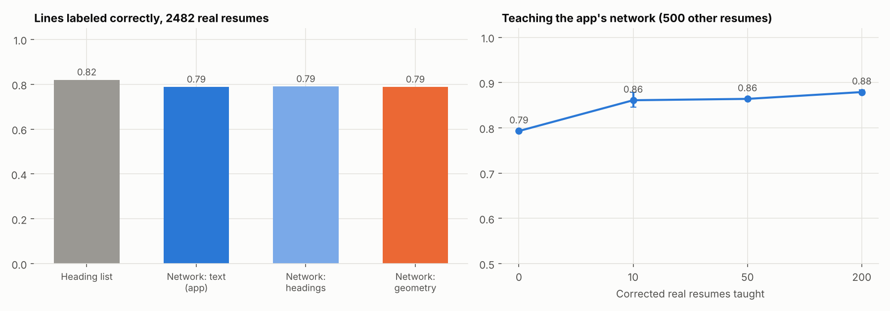

Every other test used fictional people. The public LiveCareer dataset (Kaggle "Resume Dataset", snehaanbhawal/resume-dataset, CC0 1.0, anonymized by its author) keeps each resume's HTML beside its PDF, and the HTML marks every section with a code (`SECTION_EXPR`, `SECTNAME_...` for the heading). [`ats_sim/learn/livecareer.py`](ats_sim/learn/livecareer.py) finds each PDF line's text in the HTML, in reading order, and takes its section, so 2,482 real resumes get line labels without anyone reading them: 152,628 of 156,701 lines (97.4%; the rest are the name slot, which holds a job title, stray characters, and two list items merged onto one line). Real wording and real headings, but not real layouts: nearly all are the same plain single-column page. [`scripts/real_resumes.py`](scripts/real_resumes.py) writes only aggregate numbers; the PDFs and per-resume labels stay in gitignored folders (`python scripts/fetch_public_resumes.py --pdfs`).

| Lines labeled correctly | All | Summary | Experience | Education | Skills | Headings |
|---|---|---|---|---|---|---|
| Heading-list parser | **0.82** | 0.00 | 0.97 | **0.96** | 0.43 | 0.68 |
| Network, text only (app) | 0.79 | 0.75 | 0.97 | 0.53 | 0.43 | 0.72 |
| Network, headings | 0.79 | 0.74 | 0.97 | 0.61 | 0.44 | 0.69 |
| Network, geometry | 0.79 | **0.80** | 0.97 | 0.49 | 0.46 | 0.68 |

**What it shows.**

- **On real resumes the heading list beats the network trained only on synthetic ones** (0.82 against 0.79). Real resumes mostly use the common headings ("Experience", "Education"), which the list knows, and 62% of all lines are experience, which both get right.
- **Where each fails is different.** The heading list never finds a summary (no "Summary" in its list) and misses skills behind "Highlights" or "Core Qualifications". Only 68% of real heading lines are in the list; the most common misses are Highlights (849 resumes), Accomplishments (741), Additional Information (435), Languages, Interests, Professional Affiliations, Core Qualifications and Skill Highlights. The network finds summaries (0.75 to 0.80) but labels half the education lines as something else: real education entries ("Bachelor of Science : Accounting 2010 University of ... City , State") look nothing like the synthetic ones.
- **A little teaching fixes most of it.** The Teach tab's update on 10 corrected real resumes lifts the network from 0.79 to **0.86** of lines in 500 other real resumes (0.85 to 0.88 over three draws), past the heading list. 50 give 0.86, 200 give 0.88. This is the strongest evidence so far that the Teach tab works on real documents.

**So the starting model now learns from a few real resumes (experiments 9b and 9c).** [`scripts/real_training.py`](scripts/real_training.py) retrained the network with experiment 7's training set plus 0 to 1,500 real resumes, tested on 500 real resumes it never saw and on experiment 7's held-out synthetic groups:

| Real resumes added | Real lines (500 unseen) | Hand-written F1 | Generated F1 | Designer F1 | Reference F1 |
|---|---|---|---|---|---|
| 0 | 0.83 | 0.74 | 0.80 | 0.68 | 0.84 |
| 30 (3 draws) | **0.90 to 0.91** | 0.74 to 0.75 | 0.79 to 0.80 | 0.66 to 0.69 | 0.83 to 0.84 |
| 100 | 0.91 | 0.74 | 0.79 | 0.64 | 0.82 |
| 300 | 0.90 | 0.73 | 0.77 | 0.61 | 0.82 |
| 1,500 | 0.90 | 0.71 | 0.78 | 0.67 | 0.83 |

About 3% real documents gets almost all of the gain on real resumes at no cost on the synthetic layouts; more starts to cost the unusual designs, because nearly all the real resumes share one plain layout. [`scripts/real_shipping_check.py`](scripts/real_shipping_check.py) then checked the model the app actually ships (the full synthetic corpus, about 3,300 documents) with 0, 30 or 90 real resumes, on data none of them trained on:

| App's starting model | Real resumes, lines (500 unseen) | 54 themes, field F1 | 54 themes, lines | The hand-labeled real resume, lines |
|---|---|---|---|---|
| Synthetic only | 0.79 | 0.553 | 0.68 | 0.83 |
| + 30 real | 0.86 | 0.533 | 0.71 | 0.94 |
| **+ 90 real (shipped)** | **0.89** | 0.544 | 0.68 | 1.00 |

The desktop build's starting model now includes the 90 resumes listed in [data/livecareer_train_ids.json](data/livecareer_train_ids.json) (IDs only; CI downloads those PDFs to train, and none is among the 500 test resumes). A source install includes them after `python scripts/fetch_public_resumes.py --train-pdfs`, and trains on synthetic resumes alone otherwise. The perfect score on the hand-labeled resume is one document, also used to find earlier bugs; the 500-resume result is the one to trust.

### 10. Fifty-four real resume themes from npm

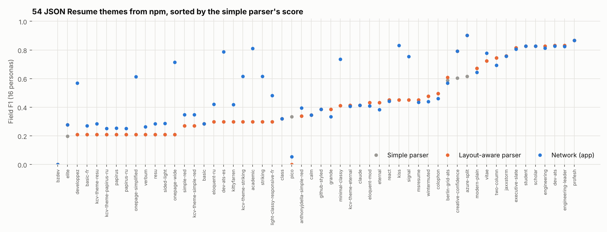

Every format so far was written by this project, even the ones copied from public templates. [JSON Resume](https://jsonresume.org) is an open resume format with community themes published on npm. [`scripts/jsonresume_formats.py`](scripts/jsonresume_formats.py) takes every theme tagged `jsonresume-theme` (72, of which 70 are MIT-licensed; list in [data/jsonresume_themes.json](data/jsonresume_themes.json)), installs it with install scripts off, renders each of the 16 personas through it with Node, and prints the HTML to a Letter PDF with Chromium. 55 themes rendered; 54 rendered all 16 personas (864 resumes). Nothing from the themes is committed, only the list and aggregate results. The answer key is still the persona, so field F1 is exact; line labels come from matching each line to the persona and the theme's own HTML headings (`ats_sim/jsonresume.py`).

| On 54 themes nobody here designed | Simple parser | Layout-aware parser | Network (app, text only) | Perfect sections (ceiling) |
|---|---|---|---|---|
| Field F1, all 864 resumes | 0.47 | 0.48 | **0.55** | 0.55 |
| Median theme | 0.40 | 0.38 | 0.45 | |

**What it shows.**

- **Most real designs defeat the simple parser.** 40 of 54 themes score below 0.5. The best (profesh, engineering, student, executive-slate) reach 0.82 to 0.84, about what this project's own clean templates score.
- **The network helps where headings are the problem.** It gains 0.15 or more over the layout-aware parser on 12 themes (developpez 0.21 to 0.57, academic 0.30 to 0.81, kiss 0.45 to 0.83), mostly themes with unusual or non-English section titles, and it reaches the perfect-section ceiling overall. It is worse by more than 0.05 on only 2.
- **The ceiling is the field rules, not the sections.** With perfect sections the score is still 0.55. Recall of the layout-aware parser by field: email 0.95, name 0.80, phone 0.74, degree 0.50, school 0.50, grad date 0.36, skills 0.23, field of study 0.11, GPA 0.06, **experience entries 0.00**. The simple parser's rules expect "Title, Company" on one line, "B.S. in Field" and a labeled "GPA"; JSON Resume themes put the company on its own line or first, print the degree and field apart, show the GPA as a bare score, and often print dates as 2026-06-01. These are limits of this simulator's simple parser, which models a basic ATS; commercial parsers handle more formats, so read this as "which designs break simple rules", not as a measurement of any product.
- **One theme breaks text extraction outright.** bzdev draws every character twice (a fake-bold effect), so the text layer reads "PPrriiyyaa RRaammaann" and every parser scores 0. A new parsing check now reports this ("Every letter is read twice"); before, the visual check caught it only as unreadable text.

**A bug found on the way (disclosed because it changed the numbers).** The first run rendered every theme in one Node process. Themes share moment.js, and a French or Russian theme set its global locale, so every theme rendered after it printed its dates as "juin 2026" or "сент. 2025", and the parsers could not read them. Each theme now renders in its own process. The fix raised grad-date recall from 0.22 to 0.36 and let 4 more themes render.

**Limits.** 16 personas per theme, so per-theme numbers are noisy (each is 16 resumes). Some themes print headings in French, Spanish, Russian or Indonesian; the English heading list cannot read those, which is realistic for those themes but makes them harder than an English resume in the same design. The themes are what is on npm today, a convenience sample of developer-made designs.

## Check your own resume

```bash
python scripts/check_resume.py my_resume.pdf --authorized yes --public-pool data/kaggle/Resume.csv
python scripts/check_resume.py my_resume.pdf --gold my_resume.gold.json   # adds per-parser accuracy
python scripts/check_resume.py my_resume.pdf --posting real_posting.txt   # score against real postings (repeatable)
```

The report (written to `private/`, which is gitignored) shows what each parser extracted side by side, parsing risks (headings a heading-list parser will miss, glyphs that do not map to text, hidden text, detected columns or tables), skills found by the curated list and by SkillNer, the knockout result under each parse, and the resume's score and rank against each posting, including two extra postings in `data/jobs_extra/`. Those two were written while testing a real student resume, so they are not a neutral benchmark for that resume; for a meaningful rank, pass real postings with `--posting`. The report also flags a degree with no extractable field of study and parsers that disagree on the school. An optional answer key in the `data/personas.json` format adds per-parser accuracy. Nothing is uploaded anywhere.

## Limitations

- **Five templates, written by one person who knew the parser.** They cover common real conventions, but they are a convenience sample, not a random draw from real resumes. The pooled intervals resample only four held-out templates, so they understate how much real designs vary.
- **The parser is heuristic on purpose.** The layout-aware mode handles one gutter per page and ruled tables or bordered boxes; it stands in for commercial layout analysis, not a measurement of any product. Its held-out numbers are optimistic after the bug fix described above.
- **Small synthetic answer key.** 16 personas and 3 postings. The public resumes add realism to the ranking pools but have no labels, and they are plain text, so they never test parsing.
- **The answer key and the resumes come from the same source**, so there is no human labeling error. That keeps the F1 numbers clean, but messy real-world inputs (scanned PDFs, ligatures, headers and footers, varied PDF generators) are not tested.
- **Experiments 2 to 4 use the classic single-column PDF** so the scorer is the only moving part; scoring results on other templates may differ.
- **Third-party engines are run, not reimplemented, but through adapters.** The mapping into this project's schema (and the lenient scoring) is a choice; another mapping could move their numbers a few points. Each engine's raw output is cached under `results/_tmp/engine_cache/` for inspection.
- **Scores are not decisions.** Real outcomes depend on recruiters, referrals and timing. Nothing here estimates anyone's chance of getting an interview.
- **The visual check reads PDFs only.** A Word file has no fixed page to render. OCR misreads some characters, so differences shorter than a dozen letters are ignored, and text in a low-contrast image may be missed.
- **Scanned resumes are parsed only from OCR text**, with one cleanup (an "@" set apart by OCR is joined back). The *With OCR* column shows what such a system might read; real OCR pipelines differ.
- **The choice of network rests on one real resume.** Every other test is synthetic, and experiment 7 shows synthetic tests can reward a model for recognizing this project's renderer. A set of consented, hand-labeled real resumes is the missing piece; *Export labels* exists to collect one.
- **The learned parser is only as good as its corrections.** It learns section boundaries, not fields; a wrong label taught by a user is learned too (Reset undoes everything). Its experiment uses exact synthetic labels and four templates.
- **Knockout source is a modeling choice.** Knockout flips assume the candidate accepted a parse-prefilled form. If candidates type their answers, layout cannot affect knockouts at all.

## Resume bullet

Suggested wording, using only claims that held across all five templates:

> Engineered a Python ATS simulator that parses, screens and ranks resumes with 3 scoring methods. Across 640 controlled resumes in 5 templates, table layouts cut PDF field-extraction F1 to 0.37 in every template and text boxes cost 25 to 74%, while a layout-aware reader recovered most of the loss; an audit showed hidden keyword stuffing fooled keyword and TF-IDF scoring but not sentence embeddings.

Do not quote "two-column cuts accuracy by 33%". That number came from the development template only; across held-out templates the F1 effect was 4 to 9%. The interesting two-column story is that it barely moves overall accuracy yet can still break the graduation-date and degree fields that knockout rules use, which makes a good interview answer. The embedding stability trade-off (experiment 4) is another.

## Repository layout

```
ats_sim/        parser, jd analyzer, knockouts, scorers, search, pipeline, renderer, experiments
data/           personas (answer key), jobs, skills list, sample PDFs (full corpus is generated)
scripts/        build_corpus.py, run_experiments.py, fetch_public_resumes.py,
                benchmark_parsers.py, check_resume.py, learning_curve.py, setup_external.sh
external/       runners for OpenResume (Node) and pyresparser (Python 3.8); no third-party code
results/parsers/      parser benchmark (ours vs OpenResume vs pyresparser vs ensemble)
results/        16-resume pool: CSVs, charts, RESULTS.md, summary.json
results/public_pool/  same experiments with 186 public distractor resumes
tests/          pytest suite (forces the LSA backend so it runs offline)
ats_sim/webapp/ the app: FastAPI server and a dependency-free HTML/CSS/JS front end
ats_sim/report.py     resume analysis shared by the app and scripts/check_resume.py
ats_sim/learn/  the neural line tagger: labels from the corpus, online learning, local model store
results/learning/     experiment 5: learning curve on new templates
results/formats/      experiment 6: the 50 generated formats and training on them
ats_sim/formats.py    generated (50), designer (12) and reference (22) formats
results/geometry/     experiment 7: text-only vs page geometry
packaging/            the desktop build (PyInstaller spec and entry point)
launchers/      double-click launchers for macOS, Windows and Linux
app.py          older Streamlit developer dashboard
.github/        GitHub Actions: tests on every push
```
