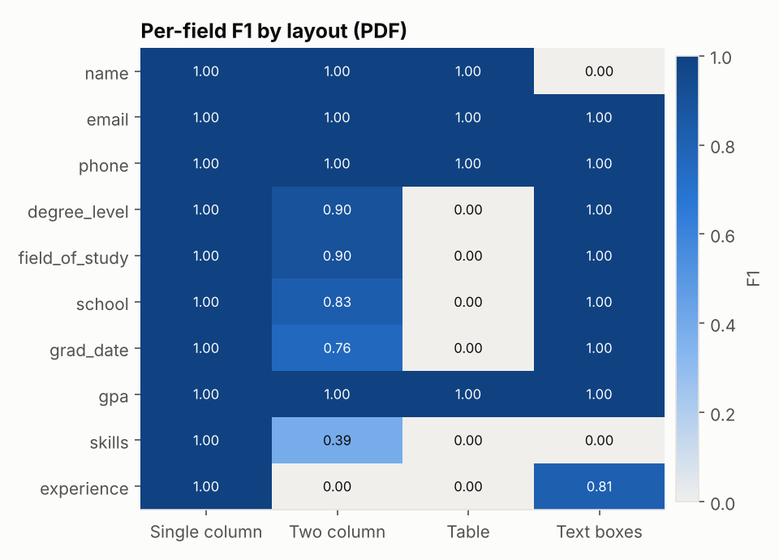
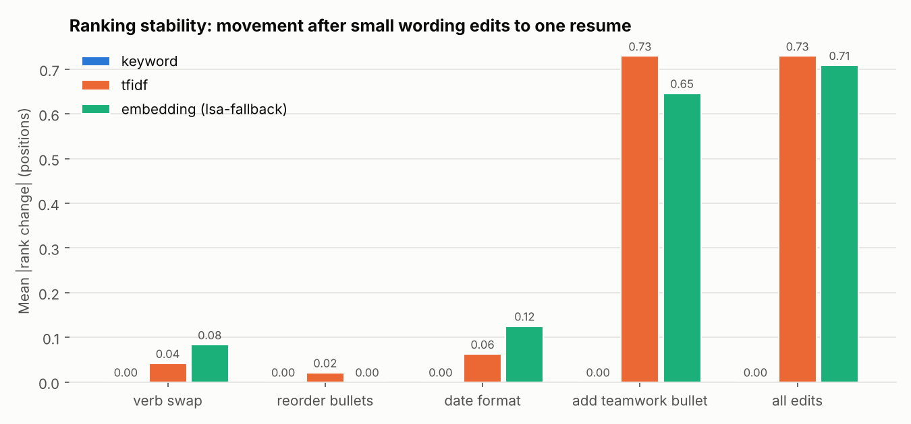

# ATS Filter Simulator

A Python simulator that parses resumes the way a simple applicant tracking system does, screens them with knockout rules, ranks them against a job posting with three scoring methods, and runs controlled experiments to measure which resume choices actually change the outcome.

This is **a simulator modeled on documented ATS behavior**, not a reproduction of any vendor's system. Workday, Greenhouse, Lever and iCIMS are proprietary, and nothing here says how any of them scores a real person.

## What it models (and what it deliberately does not)

The popular claim that "75% of resumes are auto-rejected by robots" has no solid study behind it. Documented ATS behavior comes down to three things, and the simulator models exactly those:

| Stage | Real-world behavior | Here |
|---|---|---|
| **Parse** | Turn the file into fields (contact, education, experience, skills) | `ats_sim/parser.py`: pdfplumber / python-docx, text order only, heading detection, regex fields |
| **Knockout** | Reject on application questions: work authorization, graduation date, minimum GPA, degree field | `ats_sim/knockout.py`: rule-based, with an explicit policy for fields the parser could not find |
| **Search and rank** | Recruiters run Boolean keyword searches; some newer systems add a match score | `ats_sim/search.py` (Boolean top-k) and `ats_sim/scorers.py` (keyword, TF-IDF, embedding) |

There is **no single magic score that rejects people**. Scores only order candidates who passed the knockouts. A human decides what happens next.

Knockouts are usually application-form questions, not resume parsing. Many forms are prefilled from the parse, though, and a candidate who does not correct the autofill is screened on what the parser extracted. The default here reads education fields from the parse (the uncorrected-autofill case). Work authorization always comes from the candidate's answers, because no parser can know it.

## Quick start

```bash
pip install -r requirements.txt
python -m spacy download en_core_web_sm

python scripts/build_corpus.py        # render 16 personas x 4 layouts x 2 formats = 128 resumes
python scripts/run_experiments.py     # writes CSVs, charts and results/RESULTS.md
streamlit run app.py                  # dashboard: parsed fields, knockouts, scores, ranks, search
pytest                                # 25 tests
```

The first run downloads `all-MiniLM-L6-v2` (about 90 MB) for the embedding scorer. If the download fails, the scorer falls back to an LSA embedding, warns you, and labels every chart and table with the backend it used. See [Embedding backend](#embedding-backend-read-this-before-quoting-embedding-numbers).

## Pipeline

1. **Parser** (`parser.py`). Extracts text in reading order with pdfplumber (PDF) or python-docx (DOCX body paragraphs and tables; like many simple readers it does not descend into text boxes, headers or footers). A line counts as a section heading only if it is a known heading on its own line. Fields come from regexes inside the detected sections. It is naive on purpose.
2. **Job description analyzer** (`jd.py`). Splits a posting into Requirements / Preferred / Responsibilities, finds skills from the curated list in `data/skills.json`, and adds spaCy noun phrases as lower-weight uncurated terms. It handles "Python or MATLAB" as alternatives and demotes skills after cues like "ideally" or "a plus". Degree and graduation lines feed the knockouts, not the skill list.
3. **Knockout filter** (`knockout.py`). Graduation window, minimum GPA, minimum degree level, accepted degree fields, work authorization and sponsorship. A field the parser could not find becomes `REVIEW` (default), `REJECT`, or `PASS`, depending on `missing_policy`.
4. **Scorers** (`scorers.py`).
   - *Keyword*: share of the posting's terms present verbatim (required weighs 2, preferred 1, noun phrases half). Presence is binary, so repetition does not help.
   - *TF-IDF*: cosine similarity, unigrams and bigrams, fit once on the pool so variants never change the IDF weights.
   - *Embedding*: `all-MiniLM-L6-v2`. Resume and posting are split into line chunks, each chunk is embedded, and the vectors are mean-pooled. Chunking avoids the model's 256-token limit, which would otherwise silently drop the bottom of a resume.
   - *Keyword+taxonomy* (reference only): keyword match that also accepts curated aliases and narrower tools ("ML" counts as "machine learning", "Onshape" as "CAD").
5. **Recruiter search** (`search.py`). `(Python OR MATLAB) AND "GMP" NOT intern`, with implicit AND, `-term`, phrases and parentheses. Results are ranked by log-damped term counts. Synonym expansion is optional.
6. **Report** (`app.py`). A Streamlit dashboard showing each resume's parsed fields next to its answer key, the raw text the parser saw, knockout result, three scores, ranks, live Boolean search, and the experiment charts. You can upload your own resume; it is parsed in the session and not stored.

## Data

- `data/personas.json`: 16 synthetic, fictional candidates written for this project (example.com emails, 555 phone numbers, invented schools and employers). They span ML, bioprocess, mechanical and off-domain profiles, and include deliberate edge cases: a missing GPA, a sponsorship need, a late graduation date, a non-matching degree, and candidates who write "ML" or "Onshape" instead of the posting's wording. **This file is the hand-written answer key** for field extraction.
- `data/jobs/*.json`: three synthetic postings (ML intern, biologics process engineer, mechanical design engineer), each with knockout rules.
- `data/resumes/`: the 128 rendered files (`build_corpus.py` regenerates them).
- **Kaggle (optional).** `python scripts/run_experiments.py --kaggle-csv Resume.csv --kaggle-category ENGINEERING` adds public resumes (for example the Kaggle "Resume Dataset", columns `ID, Resume_str, Category`) to every ranking pool as distractors. They have no layout and no answer key, so they never enter the layout experiment. Check each dataset's license and provenance before using it. Do not scrape LinkedIn or use real people's resumes without permission.

## Results

All numbers below come from `results/RESULTS.md`, produced by `scripts/run_experiments.py`. Every resume was rendered from the same persona content, so the layout is the only variable in experiment 1, and the wording is the only variable in experiments 2 to 4.

### 1. Layout robustness: the strongest result


| Layout | PDF F1 | Drop vs single | DOCX F1 | Drop vs single |
|---|---|---|---|---|
| Single column | 1.00 | | 1.00 | |
| Two column | 0.67 | **-33%** | 1.00 | 0% |
| Table | 0.37 | **-63%** | 1.00 | 0% |
| Text boxes | 0.65 | **-35%** | 0.63 | **-37%** |

(128 resumes: 16 personas x 4 layouts x 2 formats, micro-F1 over 10 fields.)



What breaks, and why:

- **Two-column PDF.** pdfplumber reads across the page, so each line splices the sidebar onto the main column ("SKILLS (cid:127) Maintained the lab's Git repository..."). Headings stop being on their own lines, so every experience entry is lost (F1 0.00), skills drop to 0.39, and graduation date drops to 0.76 because job dates from the next column get pulled into the education section.
- **Table PDF.** The section label and its content share a line ("EDUCATION B.S. in Computer Science"), so no section is detected at all. Contact info survives only because email and phone regexes run over the whole text.
- **Text boxes.** In PDF, the contact box shares lines with the name, so the name is lost. In DOCX, python-docx never sees text-box content, so email, phone and the entire skills list disappear.
- **Format matters as much as layout.** The same two-column and table designs parsed perfectly as DOCX, because Word tables are read cell by cell in order. "Two columns are always bad" is too strong; "two columns exported to PDF are bad for text-order parsers" is what the data supports.

Downstream effect, which is the honest answer to "why does my class require single column":

- **Keyword search barely notices.** The mean keyword-score change was between 0.000 and -0.026 for every layout. Words survive in the raw text even when structure does not, so recruiter keyword search on these resumes was largely unaffected.
- **Structured fields and knockouts do notice.** With the table PDF, 43 of 48 candidate x posting knockout results changed. Under the "missing field = human review" policy that mostly *helped* unqualified candidates (34 REJECT -> REVIEW) and slowed down qualified ones (9 PASS -> REVIEW). Under a "missing field = reject" policy, 9 candidates who passed as single column were auto-rejected as tables, plus 1 as two-column PDF.

So the defensible claim is narrower and stronger than the myth: a multi-column or table PDF does not get you silently dropped by keyword search, but it corrupts the parsed profile a recruiter sees and can trip knockout rules that depend on parsed fields.

### 2. Synonym sensitivity


21 cases across 9 term pairs (posting wording vs. a common alternative, both directions).

| Scorer | Mean score change | Cases where the resume dropped in rank |
|---|---|---|
| Keyword (exact) | -20% | 48% |
| TF-IDF | -16% | 24% |
| Embedding (see backend note) | -7% | 24% |
| Keyword + taxonomy | 0% | 0% |

Exact matching is the most brittle: "Onshape" instead of "CAD" cost 30%, "FEA" vs "finite element analysis" 25%. A curated alias list fixes it completely, which is why taxonomy-based skill normalization matters more than the choice of scoring math.

### 3. Keyword-stuffing audit

This is an **audit of weak scoring methods**, not a guide to gaming them. Every attack below is trivially caught by a human reader or by a one-line parser fix, and it misrepresents the candidate.


For candidates who started outside the top 5, share whose stuffed resume outscored the best *unstuffed* resume in the pool:

| Attack | Keyword | TF-IDF | Embedding (see backend note) |
|---|---|---|---|
| Visible repeated keyword list | 100% | 88% | 12% |
| Same list in white text | 100% | 88% | 3% |
| Whole posting pasted in white text | 100% | 100% | 79% |
| Either hidden attack, parser drops white text | 0% | 0% | 0% |

- Keyword and TF-IDF scorers are fooled by any added keyword list. Repetition specifically inflates TF-IDF (raw term counts); the presence-based keyword scorer is fooled by the first mention.
- The embedding scorer resisted keyword lists, because a few extra chunks barely move a mean-pooled resume vector. It did **not** resist a pasted copy of the posting. "Embeddings resist stuffing" is only half true.
- The effective fix lives in the parser, not the scorer: discarding white or tiny characters before scoring (`parse_resume(..., drop_invisible=True)`) neutralized both hidden attacks for every scorer. Nothing in the scorer can tell a visible keyword list from a real skills section; that is a human-review problem.

### 4. Ranking stability



Each of 16 resumes got small wording edits (verb synonyms, reordered bullets, `Jun 2025` -> `06/2025`, one generic teamwork bullet, all combined) while the rest of the pool stayed fixed.

- The keyword scorer never moved: none of the edits touched a skill term.
- TF-IDF and embedding moved on average under 1 position. One added generic bullet moved weak TF-IDF candidates up to 7 places, but only at the bottom of the pool, where scores are packed within 0.01 of each other.
- Top-5 membership changed once in 720 cases (16 resumes x 5 edits x 3 postings x 3 scorers), for the embedding scorer after one teamwork bullet. For a recruiter looking at the top of the list, small wording edits are mostly noise; near-ties at the bottom reshuffle easily.

## Embedding backend: read this before quoting embedding numbers

The committed results were generated in a sandbox that could not download `all-MiniLM-L6-v2`, so the embedding column above uses the **LSA fallback** (TF-IDF + truncated SVD fit on this small corpus). LSA is not a pretrained semantic model. It should be *worse* than MiniLM on synonyms, and its stuffing behavior may differ. The charts label it `embedding (lsa-fallback)`. The layout experiment does not use embeddings, so its results are unaffected.

To get real MiniLM numbers, run `python scripts/run_experiments.py` on a machine with internet access. The first line of output and `results/summary.json` record which backend was used.

## Limitations

- **The parser was written against this project's own template.** That is why single column scores a perfect 1.00. Commercial parsers use layout analysis and do better on multi-column PDFs, so the drops here are an upper bound for a naive text-order parser, not a measurement of any product.
- **Small synthetic pool.** 16 personas and 3 postings. Ranking effects in a pool this size are coarse: one position is about 6% of the pool. The Kaggle option adds distractors but no labels.
- **One template per layout.** Real two-column resumes vary (sidebar width, PDF export engine, Canva vs Word). Other designs may fail differently.
- **The answer key and the resumes come from the same source**, so there is no human labeling error. That makes the F1 numbers clean, but it also means messy real-world inputs (scanned PDFs, icons, ligatures, headers and footers) are not tested.
- **Scores are not decisions.** Real outcomes depend on recruiters, referrals and timing. Nothing here estimates anyone's chance of getting an interview.
- **Knockout source is a modeling choice.** Results for knockout flips assume the candidate accepted a parse-prefilled form. If candidates type their answers, layout cannot affect knockouts at all.

## Resume bullet

Suggested wording, using the measured numbers and claims the data supports:

> Engineered a Python ATS simulator that parses, screens and ranks resumes with 3 scoring methods. Across 128 controlled test resumes, two-column PDF layouts cut field-extraction F1 by 33% (tables by 63%) while leaving keyword search nearly unchanged; also showed that white-text keyword stuffing fooled keyword and TF-IDF scoring until a parser fix removed it.

Avoid "two-column layouts cut accuracy by X%" without "PDF". The same designs saved as DOCX parsed perfectly, and an interviewer who knows parsers may ask.

## Repository layout

```
ats_sim/        parser, jd analyzer, knockouts, scorers, search, pipeline, renderer, experiments
data/           personas (answer key), jobs, skills list, rendered resumes
scripts/        build_corpus.py, run_experiments.py
results/        CSVs, charts, RESULTS.md, summary.json
tests/          pytest suite (forces the LSA backend so it runs offline)
app.py          Streamlit dashboard
```
