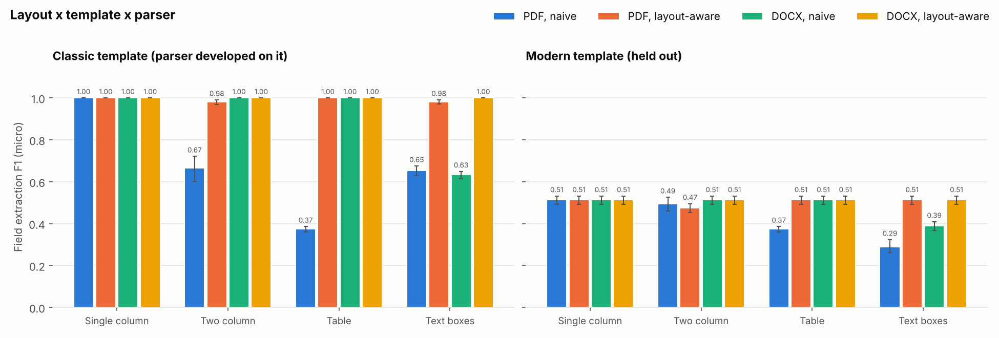

# ATS Filter Simulator

[](https://github.com/shreyosecret/ATSResumeFilter/actions/workflows/tests.yml)

A Python simulator that parses resumes the way a simple applicant tracking system does, screens them with knockout rules, ranks them against a job posting with three scoring methods, and runs controlled experiments to measure which resume choices actually change the outcome.

This is **a simulator modeled on documented ATS behavior**, not a reproduction of any vendor's system. Workday, Greenhouse, Lever and iCIMS are proprietary, and nothing here says how any of them scores a real person.

## What it models (and what it deliberately does not)

The popular claim that "75% of resumes are auto-rejected by robots" has no solid study behind it. Documented ATS behavior comes down to three things, and the simulator models exactly those:

| Stage | Real-world behavior | Here |
|---|---|---|
| **Parse** | Turn the file into fields (contact, education, experience, skills) | `ats_sim/parser.py`: pdfplumber / python-docx, heading detection, regex fields. Two reading-order modes: naive (text order) and layout-aware (tables, boxes, columns) |
| **Knockout** | Reject on application questions: work authorization, graduation date, minimum GPA, degree field | `ats_sim/knockout.py`: rule-based, with an explicit policy for fields the parser could not find |
| **Search and rank** | Recruiters run Boolean keyword searches; some newer systems add a match score | `ats_sim/search.py` (Boolean top-k) and `ats_sim/scorers.py` (keyword, TF-IDF, embedding) |

There is **no single magic score that rejects people**. Scores only order candidates who passed the knockouts. A human decides what happens next.

Knockouts are usually application-form questions, not resume parsing. Many forms are prefilled from the parse, though, and a candidate who does not correct the autofill is screened on what the parser extracted. The default here reads education fields from the parse (the uncorrected-autofill case). Work authorization always comes from the candidate's answers, because no parser can know it.

## Quick start

```bash
pip install -r requirements.txt
python -m spacy download en_core_web_sm

python scripts/build_corpus.py                 # 16 personas x 2 templates x 2 formats x 4 layouts = 256 resumes
python scripts/run_experiments.py --require-minilm      # results/ (fails rather than falling back to LSA)
streamlit run app.py                           # dashboard
pytest                                         # 39 tests (also run by GitHub Actions on every push)

# optional: rerun the ranking experiments with ~190 public resumes as distractors
python scripts/fetch_public_resumes.py         # CC0 dataset, no Kaggle account needed
python scripts/run_experiments.py --require-minilm --public-pool data/kaggle/Resume.csv --out results/public_pool
```

The first run downloads `all-MiniLM-L6-v2` (about 90 MB). Without `--require-minilm`, a failed download falls back to an LSA embedding with a warning, and every chart and table is labeled with the backend actually used. All committed results use MiniLM.

## Pipeline

1. **Parser** (`parser.py`). A line counts as a section heading only if it is a known heading on its own line; fields come from regexes inside the detected sections. Two reading-order modes share those exact rules:
   - *naive*: pdfplumber's text order for PDF; body paragraphs and tables for DOCX (like many simple readers, no text boxes, headers or footers).
   - *layout-aware*: ruled tables are read cell by cell, bordered boxes as blocks, and a column gutter, if found, splits the page so the left column is read before the right. Boxes floating beside the main text are read after it. DOCX text boxes are read after their anchor paragraph.
2. **Job description analyzer** (`jd.py`). Splits a posting into Requirements / Preferred / Responsibilities, finds skills from the curated list in `data/skills.json`, and adds spaCy noun phrases as lower-weight uncurated terms. It handles "Python or MATLAB" as alternatives and demotes skills after cues like "ideally" or "a plus". Degree and graduation lines feed the knockouts, not the skill list.
3. **Knockout filter** (`knockout.py`). Graduation window, minimum GPA, minimum degree level, accepted degree fields, work authorization and sponsorship. A field the parser could not find becomes `REVIEW` (default), `REJECT`, or `PASS`, depending on `missing_policy`.
4. **Scorers** (`scorers.py`).
   - *Keyword*: share of the posting's terms present verbatim (required weighs 2, preferred 1, noun phrases half). Presence is binary, so repetition does not help.
   - *TF-IDF*: cosine similarity, unigrams and bigrams, fit once on the pool so variants never change the IDF weights.
   - *Embedding*: `all-MiniLM-L6-v2`. The text is split into line chunks (long lines are windowed to 40 words), each chunk is embedded, and the vectors are mean-pooled. Chunking avoids the model's 256-token limit, which would otherwise silently drop most of a resume.
   - *Keyword+taxonomy* (reference only): keyword match that also accepts curated aliases and narrower tools ("ML" counts as "machine learning", "Onshape" as "CAD").
5. **Recruiter search** (`search.py`). `(Python OR MATLAB) AND "GMP" NOT intern`, with implicit AND, `-term`, phrases and parentheses. Results are ranked by log-damped term counts. Synonym expansion is optional.
6. **Report** (`app.py`). A Streamlit dashboard: pick a posting, layout, format, template and parser mode, then see each resume's parsed fields next to its answer key, the raw text the parser saw, knockout result, three scores, ranks, live Boolean search, and the experiment charts. You can upload your own resume; it is parsed in the session and deleted.

## Data

- `data/personas.json`: 16 synthetic, fictional candidates written for this project (example.com emails, 555 phone numbers, invented schools and employers). They span ML, bioprocess, mechanical and off-domain profiles, and include deliberate edge cases: a missing GPA, a sponsorship need, a late graduation date, a non-matching degree, and candidates who write "ML" or "Onshape" instead of the posting's wording. **This file is the hand-written answer key** for field extraction.
- Two templates, rendered by `ats_sim/render.py`:
  - **classic**: the template the parser was developed against (ALL-CAPS headings, "B.S. in Field", "Title | Company | dates").
  - **modern**: a **held-out** template, written after the parser's rules were frozen and never used to tune them. It has title-case headings (one, "Skills & Certifications", outside the parser's heading list), a profile summary, icon glyphs in the contact line, "Bachelor of Science, Field", right-aligned dates, skills grouped under category labels, and experience before education. A test (`test_classic_parser_rules_do_not_cover_modern_template`) fails if anyone tunes the parser on it.
- `data/jobs/*.json`: three synthetic postings (ML intern, biologics process engineer, mechanical design engineer), each with knockout rules.
- `data/resumes/`: the 256 rendered files (`build_corpus.py` regenerates them).
- **Public resumes (optional).** `scripts/fetch_public_resumes.py` downloads the Kaggle "Resume Dataset" (snehaanbhawal/resume-dataset, CC0 1.0) from its Hugging Face mirror into the gitignored `data/kaggle/`. 186 resumes from the Engineering, IT, Aviation and Automobile categories join every ranking pool as distractors. They have no layout and no answer key, so they never enter the layout experiment, and nothing derived from an individual resume is committed. No LinkedIn scraping, and no real resumes used without permission.

## Results

All numbers come from `results/RESULTS.md` (16-resume pool) and `results/public_pool/RESULTS.md` (202-resume pool), produced by `scripts/run_experiments.py` with all-MiniLM-L6-v2. Brackets are 95% bootstrap confidence intervals over the 16 personas (2,000 resamples; drops are paired against the same personas' single-column results).

### 1. Layout robustness: the strongest result


Classic template, naive parser, micro-F1 over 10 fields:

| Layout | PDF F1 | Drop vs single | DOCX F1 | Drop vs single |
|---|---|---|---|---|
| Single column | 1.00 | | 1.00 | |
| Two column | 0.67 [0.60, 0.72] | **-33% [28, 40]** | 1.00 | 0% |
| Table | 0.37 [0.36, 0.39] | **-63% [61, 64]** | 1.00 | 0% |
| Text boxes | 0.65 [0.63, 0.67] | **-35% [33, 37]** | 0.63 [0.62, 0.65] | **-37% [35, 38]** |

What breaks, and why:

- **Two-column PDF.** pdfplumber reads across the page, so each line splices the sidebar onto the main column ("SKILLS (cid:127) Maintained the lab's Git repository..."). Headings stop being on their own lines, so every experience entry is lost, skills drop to 0.39, and graduation dates drop to 0.76 because job dates from the next column get pulled into the education section.
- **Table PDF.** The section label and its content share a line ("EDUCATION B.S. in Computer Science"), so no section is detected at all. Contact info survives only because email and phone regexes run over the whole text.
- **Text boxes.** In PDF, the contact box shares lines with the name, so the name is lost. In DOCX, python-docx never sees text-box content, so email, phone and the entire skills list disappear.
- **Format matters as much as layout.** The same two-column and table designs parsed perfectly as DOCX, because Word tables are read cell by cell in order.

A note on `(cid:127)`: that is how pdfminer prints a bullet glyph it cannot map to Unicode. Many real parsers produce the same artifact; it is left in deliberately and does not affect any field.

#### Held-out template and a better parser



| | Classic, naive | Classic, layout-aware | Modern (held out), naive | Modern, layout-aware |
|---|---|---|---|---|
| PDF single column | 1.00 | 1.00 | 0.51 [0.49, 0.53] | 0.51 |
| PDF two column | 0.67 | 0.98 [0.97, 0.99] | 0.49 (drop 4% [-1, 9]) | 0.47 |
| PDF table | 0.37 | 1.00 | 0.37 (drop 27% [24, 30]) | 0.51 |
| PDF text boxes | 0.65 | 0.98 [0.97, 0.99] | 0.29 (drop 44% [36, 49]) | 0.51 |
| DOCX text boxes | 0.63 | 1.00 | 0.39 (drop 24% [23, 25]) | 0.51 |

- **The perfect single-column baseline was partly the parser grading its own homework.** On the held-out template, the same naive parser scores 0.51 even on a clean single-column PDF. "Bachelor of Science, Computer Science" has no "in", so the field of study is missed. "Title, Company" has no "|", so every company is missed. "Skills & Certifications" is not a known heading, so the skills list is empty.
- **Layout still hurts on the held-out template**: tables cost 27% and text boxes 44% even from that lower baseline. Two-column is not significantly worse there (the CI includes 0), because the template has already lost what the column interleaving would break.
- **Layout-aware reading recovers almost all of the layout loss** (classic: 0.37 to 1.00 for tables, 0.67 to 0.98 for two columns; what remains is line wrapping in narrow columns). It cannot fix wording conventions: on the modern template every layout tops out at the single-column 0.51. In one case it makes things slightly worse: modern two-column falls from 0.49 to 0.47, because clean reading order lets the parser find every "Title, Company" line and misread each one. Better reading order can turn misses into confident wrong answers.

Downstream effect, which is the honest answer to "why does my class require single column":

- **Keyword search barely notices.** The mean keyword-score change was between 0.000 and -0.026 for every layout and template. Words survive in the raw text even when structure does not.
- **Structured fields and knockouts do notice.** With the classic table PDF, 43 of 48 candidate x posting knockout results changed. Under the "missing field = human review" policy that mostly *helped* unqualified candidates (34 REJECT -> REVIEW) and slowed down qualified ones (9 PASS -> REVIEW). Under "missing field = reject", 9 candidates who passed as single column were auto-rejected as tables, plus 1 as two-column PDF.
- **Wording conventions can matter more than layout.** Under "missing field = reject", **none** of the 48 candidate x posting pairs passed with the held-out template, even as clean single-column PDFs (9 pass with the classic template). The degree field is unreadable to this parser, so every candidate is rejected for a "missing" field of study. Single column is necessary, not sufficient.

### 2. Synonym sensitivity


21 cases across 9 term pairs (posting wording vs. a common alternative, both directions).

| Scorer | Mean score change [95% CI] | Dropped in rank (16-pool) | Dropped in rank (202-pool) |
|---|---|---|---|
| Keyword (exact) | -20% [-24, -16] | 48% | 62% |
| TF-IDF | -16% [-23, -9] | 24% | 29% |
| Embedding (MiniLM) | **-0.3% [-1.3, +0.6]** | 10% | 29% |
| Keyword + taxonomy | 0% | 0% | 0% |

Exact matching is the most brittle: "Onshape" instead of "CAD" cost 30%, "FEA" vs "finite element analysis" 25%. MiniLM's score barely moved for any pair, and a curated alias list fixes keyword matching completely. In the larger pool, even MiniLM's tiny shifts move some resumes, because scores there are tightly packed.

### 3. Keyword-stuffing audit

This is an **audit of weak scoring methods**, not a guide to gaming them. Every attack below is trivially caught by a human reader or by a one-line parser fix, and it misrepresents the candidate.


For candidates who started outside the top 5, the share whose stuffed resume outscored the best *unstuffed* resume in the pool:

| Attack | Keyword | TF-IDF | Embedding (MiniLM) |
|---|---|---|---|
| Visible repeated keyword list | 100% | 88% [76, 97] | **0%** |
| Same list in white text | 100% | 88% [76, 97] | **0%** |
| Whole posting pasted in white text | 100% | 100% | **42% [27, 61]** |
| Either hidden attack, parser drops white text | 0% | 0% | 0% |

- Keyword and TF-IDF scorers are fooled by any added keyword list. Repetition specifically inflates TF-IDF (raw term counts); the presence-based keyword scorer is fooled by the first mention.
- MiniLM was never pushed past the best genuine candidate by a keyword list, though it still lifted weak resumes: 79 to 85% of them entered the top 5 in the 16-resume pool, and 30 to 45% in the 202-resume pool. A pasted copy of the posting beat the best genuine resume 42% of the time (48% [32, 62] in the larger pool). "Embeddings resist stuffing" is true for keyword lists, false for pasted postings.
- The effective fix lives in the parser, not the scorer: discarding white or tiny characters before scoring (`parse_resume(..., drop_invisible=True)`) neutralized both hidden attacks for every scorer. Nothing in a scorer can tell a visible keyword list from a real skills section; that is a human-review problem.

### 4. Ranking stability


Each of 16 resumes got small wording edits (verb synonyms, reordered bullets, `Jun 2025` -> `06/2025`, one generic "collaborated with cross-functional teams" bullet, all combined) while the rest of the pool stayed fixed. 240 cases per scorer.

| Mean \|rank change\| | Keyword | TF-IDF | Embedding (MiniLM) |
|---|---|---|---|
| 16-resume pool, one generic bullet | 0 | 0.7 | 0.6 |
| 202-resume pool, one generic bullet | 0 | 3.9 | **12.2** (max 34) |
| 202-resume pool, verb synonyms | 0 | 1.1 | 2.7 |
| Top-5 changes, 202-resume pool | 0 | 4 | **7** |

- The keyword scorer never moved: none of the edits touched a skill term.
- **The scorer that best resists synonyms and keyword lists is the least stable ranker.** Mean-pooled embeddings shift with every sentence, so one generic bullet moved MiniLM rankings by 12 positions on average in a realistic pool. That would have been invisible in the 16-resume pool, where the same edit moved resumes less than one position.
- There is no free lunch: exact matching is stable but blind to synonyms; embeddings understand synonyms but react to filler.

## Limitations

- **One held-out template is not a template distribution.** It shows the classic baseline was optimistic, but the true spread across real resume designs is unknown. The bootstrap intervals cover sampling over personas only, not over templates, so the template effect is a larger uncertainty than any interval shown.
- **The parser is heuristic on purpose.** The layout-aware mode handles one gutter per page and ruled tables or bordered boxes; it is a stand-in for commercial layout analysis, not a measurement of any product.
- **Small synthetic answer key.** 16 personas and 3 postings. The public resumes add realism to the ranking pools but have no labels, and they are plain text, so they never test parsing.
- **The answer key and the resumes come from the same source**, so there is no human labeling error. That makes the F1 numbers clean, but messy real-world inputs (scanned PDFs, ligatures, headers and footers) are not tested.
- **Scores are not decisions.** Real outcomes depend on recruiters, referrals and timing. Nothing here estimates anyone's chance of getting an interview.
- **Knockout source is a modeling choice.** Knockout flips assume the candidate accepted a parse-prefilled form. If candidates type their answers, layout cannot affect knockouts at all.

## Resume bullet

Suggested wording, using the measured numbers and claims the data supports:

> Engineered a Python ATS simulator that parses, screens and ranks resumes with 3 scoring methods. Across 256 controlled test resumes, two-column PDF layouts cut field-extraction F1 by 33% (95% CI 28 to 40%) and tables by 63%, while a layout-aware reader recovered nearly all of it; an audit showed keyword and TF-IDF scoring were fooled by hidden keyword stuffing that sentence embeddings resisted.

Avoid "two-column layouts cut accuracy by X%" without "PDF". The same designs saved as DOCX parsed perfectly, and an interviewer who knows parsers may ask. If space allows, the embedding stability trade-off (experiment 4) makes a strong interview story.

## Repository layout

```
ats_sim/        parser, jd analyzer, knockouts, scorers, search, pipeline, renderer, experiments
data/           personas (answer key), jobs, skills list, rendered resumes
scripts/        build_corpus.py, run_experiments.py, fetch_public_resumes.py
results/        16-resume pool: CSVs, charts, RESULTS.md, summary.json
results/public_pool/  same experiments with 186 public distractor resumes
tests/          pytest suite (forces the LSA backend so it runs offline)
app.py          Streamlit dashboard
.github/        GitHub Actions: tests on every push
```
